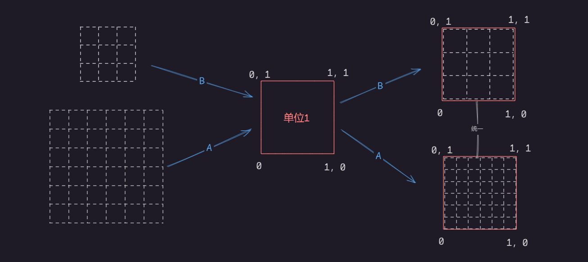

# Uniforms

## Uniforms

我们知道了 GPU 如何处理并行线程，每个线程负责给完整图像的一部分配置颜色。尽管每个线程和其他线程之间不能有数据交换，但我们能从 CPU 给每个线程输入数据。因为显卡的架构，所有线程的输入值必须**统一（uniform）**，而且必须设为**只读**。也就是说，每条线程接收相同的数据，并且是不可改变的数据。

这些输入值叫做 uniform （统一值），它们的数据类型通常为：
> `float`, 
> `vec2`,
> `vec3`, 
> `vec4`,
> `mat2`, 
> `mat3`,
> `mat4`,
> `sampler2D`
> `samplerCube`

uniform 值需要数值类型前后一致。且在 shader 的开头，在设定精度之后，就对其进行定义。

```glsl es
#ifdef GL_ES
precision mediump float;
#endif

uniform vec2 u_resolution; // 画布尺寸（宽，高）
uniform vec2 u_mouse;      // 鼠标位置（在屏幕上哪个像素）
uniform float u_time;      // 时间（加载后的秒数）
```

你可以把 uniforms 想象成连通 GPU 和 CPU 的许多小的桥梁。

按业界传统应在 uniform 值的名字前加 u_ ，这样一看即知是 uniform。比如：
> u_time （时间）、
> u_resolution （画布尺寸）、
> u_mouse （鼠标位置）

尽管如此你也还会见到各种各样的名字。比如 (ShaderToy.com就用了如下的名字)
```glsl es
uniform vec3 iResolution;   // 视口分辨率（以像素计）
uniform vec4 iMouse;        // 鼠标坐标 xy： 当前位置, zw： 点击位置
uniform float iTime;        // shader 运行时间（以秒计）
```
> 注意：这种风格只在ShaderToy适用。

我们来看看实际操作中的 uniform 吧。在下面的代码中我们使用 u_time 加上一个 sin 函数，来展示图中红色的动态变化。
```glsl es
#ifdef GL_ES
precision mediump float;
#endif

uniform float u_time;

void main(){
  gl_FragColor = vec4(abs(sin(u_time)),0.0,0.0,1.0);
}
```

GLSL 还有更多惊喜。GPU 的硬件加速支持我们使用角度，三角函数和指数函数。

> `sin()`,` cos()`, `tan()`, `asin()`, `acos()`, `atan()`, `pow()`, `exp()`, `log()`, `sqrt()`, `abs()`, `sign()`, `floor()`, `ceil()`, `fract()`, `mod()`, `min()`, `max()` 和 `clamp()`。

可以结合这些函数：做一些有趣的事情。
- 降低颜色变化的速率，直到肉眼都看不出来。
- 加速变化，直到颜色静止不动。
- 玩一玩 RGB 三个通道，分别给三个颜色不同的变化速度，看看能不能做出有趣的效果。

## gl_FragCoord

就像 GLSL 有个默认输出值 `vec4 gl_FragColor` 一样，它也有一个默认输入值`vec4 gl_FragCoord`。

gl_FragCoord：存储了活动线程正在处理的`像素`或`屏幕碎片`的坐标。有了它我们就知道了屏幕上的哪一个线程正在运转。

为什么我们不叫 `gl_FragCoord` uniform （统一值）呢？因为每个像素的坐标都不同，所以我们把它叫做 varying（变化值）。

```glsl es
#ifdef GL_ES
precision mediump float;
#endif

uniform vec2 u_resolution;
uniform float u_mouse;
uniform float u_time;

void main(){
  vec2 st = gl_FragCoord.xy/u_resolution; // st等同于uv坐标
  gl_FragColor = vec4(st.x,st.y,0.0,1.0);
}
```
> 上述代码中我们用 gl_FragCoord.xy 除以 u_resolution，对坐标进行了**规范化**（归一化）。

> 这样做是为了使所有的值落在 0.0 到 1.0 之间，这样就可以轻松把 X 或 Y 的值映射到红色或者绿色通道。



:::details 拓展：gl_FragCoord.xy / u_resolution 理解除法的意义
`6/8 = ` 这里将8视为单1，6则为0.75；类似于进制的概念。
:::

:::info 练习
(0.0,0.0) 坐标在画布上的哪里吗？

(1.0,0.0), (0.0,1.0), (0.5,0.5) 和 (1.0,1.0) 呢？

你知道如何用未规范化（normalized）的 u_mouse 吗？你可以用它来移动颜色吗？

你可以用 u_time 和 u_mouse 来改变颜色的图案吗？不妨琢磨一些有趣的途径。
:::
