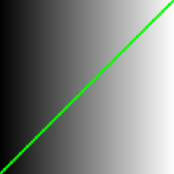
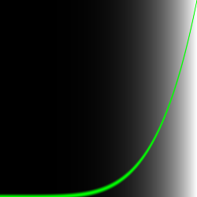
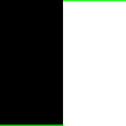
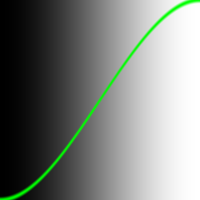
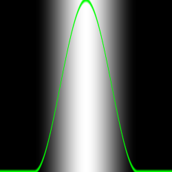

# 绘画算法

宫城先生的粉刷课（来自电影龙威小子的经典桥段）。


## 造型函数

之前我们把规范化后的 x,y 坐标映射（map）到了红色和绿色通道。

本质上说我们是建造了这样一个函数：输入一个二维向量（x，y），然后返回一个四维向量（r，g，b，a）。

但在我们跨维度转换数据之前，我们先从更加…更加简单的开始。我们来建一个只有一维变量的函数。你花越多的时间和精力在这上面，你的 shader 功夫就越厉害。

接下来的代码结构就是我们的基本功。在它之中我们对规范化的 x 坐标（st.x）进行可视化。

有两种途径：
> 一种是用亮度（度量从黑色到白色的渐变过程）
> 
> 一种是在顶层绘制一条绿色的线（在这种情况下 x 被直接赋值给 y）。

不用过分在意绘制函数，下面会更加详细地解释它。

```glsl es
#ifdef GL_ES
precision mediump float
#endif

uniform vec2 u_resolution;
uniform vec2 u_mouse;
uniform float u_time;

float polt(vec2 st){
  return smoothstep(0.01,0.0,abs(st.y-st.x));
}

void main(){
  vec2 st = gl_FragCoord.xy/u_resolution;
  float x = st.x;
  float y = st.y;
  vec3 color = vec3(x);

  // line 
  float pct = polt(st);
  color = (1.0-pct)*color + pct*vec3(0.0,1.0,0.0);
  
  gl_FragColor = vec4(color,1.0);
}
```

> smoothstep 插值获得

> 简注 ：vec3 类型构造器“明白”你想要把一个值赋值到颜色的三个通道里，就像 vec4 明白你想要构建一个四维向量，三维向量加上第四个值（比如颜色的三个值加上透明度）。

这些代码就是你的基本功；遵守和理解它非常重要。你将会一遍又一遍地回到 0.0 到 1.0 这个区间。你将会掌握融合与构建这些代码的艺术。

这些 x 与 y（或亮度）之间一对一的关系称作**线性插值（linear interpolation）**。
> **插值**是**离散函数逼近的重要方法**，利用它可通过函数在有限个点处的取值状况，估算出函数在其他点处的近似值。**因为对计算机来说，屏幕像素是离散的而不是连续的**，计算机图形学常用插值来填充图像像素之间的空隙。:star::star::star:

现在起我们可以用一些数学函数来改造这些代码行。比如说我们可以做一个求 x 的 5 次幂的曲线。
```glsl es{20}
#ifdef GL_ES
precision mediump float;
#endif

#define PI 3.14159265359 // 宏末尾不能加分号

uniform vec2 u_resolution;
uniform vec2 u_mouse;
uniform float u_time;

float polt(vec2 st, float y) {
  float p1 = smoothstep(y - 0.01, y, st.y);
  float p2 = smoothstep(y, y + 0.01, st.y);
  return p1 - p2;
}

void main() {
  vec2 st = gl_FragCoord.xy / u_resolution;

  float y = pow(st.x, 5.0);

  vec3 color = vec3(y);

  // line
  float pct = polt(st, y);
  color = (1.0 - pct) * color + vec3(0.0, 1.0, 0.0) * pct;

  gl_FragColor = vec4(color, 1.0);
}
```

> smoothstep插值出两个相同(0.01个系数差)的值相减

GLSL 有很多原生函数。大多数原生函数都是硬件加速的，也就是说如果你正确使用这些函数，你的代码就会跑得更快。

## 函数

`pow()` : pow() （求x的y次幂）是 GLSL 的一个原生函数，GLSL 有很多原生函数。大多数原生函数都是硬件加速的，也就是说如果你正确使用这些函数，你的代码就会跑得更快。

`exp()`: 以自然常数e为底的指数函数。

`log()`: 对数函数

`sqrt()`:平方根函数

`PI`: 当你用 Pi 来玩的时候有些方程会变得更有趣。在上面我们定义了一个宏，使得每当程序调用 PI 的时候就用 3.14159265359 来替换它。

:::info 练习
1. 将上面的指数改为不同的值试试看：20.0，2.0，1.0，0.0，0.2 或 0.02。

2. 理解值和指数之间的关系非常重要。这些数学函数可以让你灵动地控制你的代码，就像是给数据做针灸一样。

3. 将上面的指数函数替换成其他函数，设置不同的值。
:::

## 插值函数

GLSL 还有一些独特的原生`插值函数`可以被硬件加速。

`step()`： 插值函数需要输入两个参数。第一个是极限或阈值，第二个是我们想要检测或通过的值。对任何小于阈值的值，返回 0.0，大于阈值，则返回 1.0。

```glsl es
// float y = pow(st.x, 5.0);
float y = step(0.5,st.x); // [!code focus]
```


`smoothstep()`：当给定一个范围的上下限和一个数值，这个函数会在已有的范围内给出插值。前两个参数规定转换的开始和结束点，第三个是给出一个值用来插值。
```glsl es
// float y = pow(st.x, 5.0);
float y = smoothstep(0.0,1.0,st.x); // [!code focus]
```



在之前的例子中，我们用到 smoothstep 在 plot() 函数中画了一条绿色的线。这个函数会对给出的 x 轴上的每个值，在特定的 y 值处制造一个凹凸形变。如何做到呢？通过把两个 smoothstep() 连接到一起。来看看下面这个函数，用它替换上面的第 20 行，把它想成是一个垂直切割。背景看起来很像一条线，不是吗？

```glsl es
// float y = pow(st.x, 5.0);
float y = smoothstep(0.2,0.5,st.x) - smoothstep(0.5,0.8,st.x); // [!code focus]
```


## 正弦和余弦函数

当你想用数学来制造动效，形态或去混合数值，sin 和 cos 就是你的最佳伙伴。

简单来说，当我们给出一个角度（这里采用**弧度**制），它就会返回半径为一的圆上一个点的 x 坐标（cos）和 y 坐标（sin）。

正因为 sin 和 cos 返回的是规范化的值（即值域在 -1 和 1 之间），且如此流畅，这就使得它成为一个极其强大的工具。

:::info 练习
1. 在 sin 里让 x 加上时间（u_time）。让sin 曲线随 x 轴动起来。

2. 在 sin 里用 PI 乘以 x。注意 sin 曲线上下波动的两部分如何收缩了，现在 sin 曲线每两个整数循环一次。

3. 在 sin 里用时间（ u_time）乘以 x。观察各阶段的循环如何变得越来越频繁。注意 u_time 可能已经变得非常大，使得图像难以辨认。

4. 给 sin(x)（注意不是 sin 里的 x）加 1.0。观察曲线是如何向上移动的，现在值域变成了 0.0 到 2.0。

5. 给 sin(x) 乘以 2.0。观察曲线大小如何增大两倍。

6. 计算 sin(x) 的绝对值（abs()）。现在它看起来就像一个弹力球的轨迹。

7. 只选取 sin(x) 的小数部分（fract()）。

8. 使用向正无穷取整（ceil()）和向负无穷取整（floor()），使得 sin 曲线变成只有 1 和 -1 的电子波。
:::

## 其他有用的函数

最后一个练习中我们介绍了一些新函数。现在我们来一个一个试一遍。依次取消注释下列各行，理解这些函数，观察它们是如何运作的。你一定在奇怪……为什么要这么做呢？Google 一下“generative art”（生成艺术）你就知道了。要知道这些函数就是我们的栅栏。我们现在控制的是它在一维中的移动，上上下下。很快，我们就可以尝试二维、三维甚至四维了！

```glsl es
y = mod(x,0.5); // 返回 x 对 0.5 取模的值（相当于将x，按0.5划分）
//y = fract(x); // 仅仅返回数的小数部分
//y = ceil(x);  // 向正无穷取整
//y = floor(x); // 向负无穷取整
//y = sign(x);  // 提取 x 的正负号
//y = abs(x);   // 返回 x 的绝对值
//y = clamp(x,0.0,1.0); // 把 x 的值限制在 0.0 到 1.0
//y = min(0.0,x);   // 返回 x 和 0.0 中的较小值
//y = max(0.0,x);   // 返回 x 和 0.0 中的较大值  
```
深入理解这些函数
[mod](https://thebookofshaders.com/glossary/?search=mod)

[fract](https://thebookofshaders.com/glossary/?search=fract)

[ceil](https://thebookofshaders.com/glossary/?search=ceil)

[floor](https://thebookofshaders.com/glossary/?search=floor)

[sign](https://thebookofshaders.com/glossary/?search=sign)

[abs](https://thebookofshaders.com/glossary/?search=abs)

[clamp](https://thebookofshaders.com/glossary/?search=clamp)

[min](https://thebookofshaders.com/glossary/?search=min)

[max](https://thebookofshaders.com/glossary/?search=max)


## 造型函数进阶

[多项式造型函数](https://www.flong.com/archive/texts/code/shapers_poly/)

[指数造型函数](https://www.flong.com/archive/texts/code/shapers_exp/)

[圆与椭圆的造型函数](https://www.flong.com/archive/texts/code/shapers_circ/)

[贝塞尔和其他参数化造型函数](https://www.flong.com/archive/texts/code/shapers_bez/)

## GLSL Function Gallery

```glsl es
y = 1.0 - pow(abs(x),0.5);

y = pow(cos(u_mouse.x * 0.1 * x), 0.5);

y = pow(cos(u_time * x), 0.5);

y = pow(cos(PI * x / 2.0), 0.5);
```

## Iñigo Quiles 收集函数

[Iñigo Quiles](https://iquilezles.org/) 收集了一套[有用的函数](https://iquilezles.org/articles/functions/)


## Iñigo Quiles 函数工具箱

[函数工具箱](https://graphtoy.com/)

## LYGIA 着色器库

[传送门](https://lygia.xyz/)