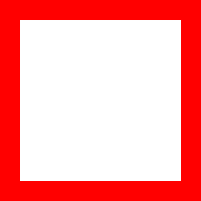
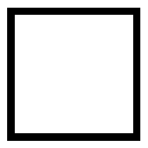
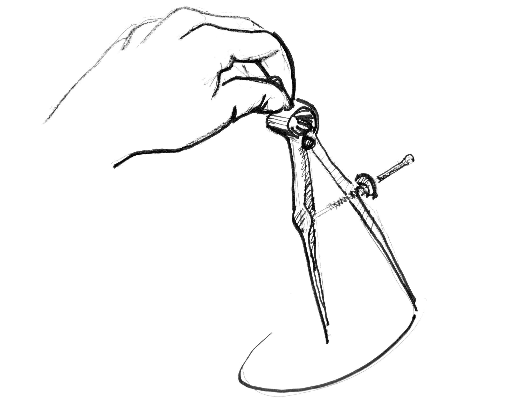
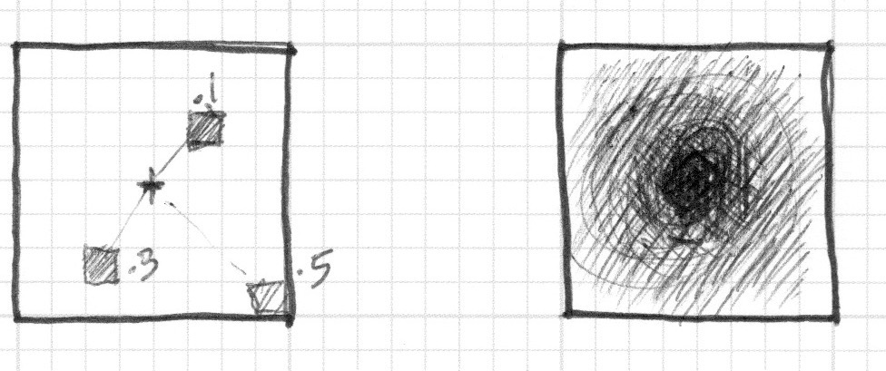
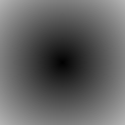
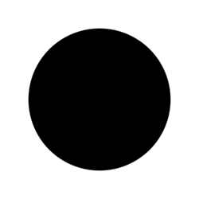

# 形状


终于！我们一直学习的技能就等着这一刻！你已经学习过GLSL的大部分基础，类型和函数。你一遍又一遍的练习你的造型方程。是时候把他们整合起来了。你就是为了这个挑战而来的！在这一章里，你会学习到如何以一种并行处理方式来画简单的图形。

## 长方形

想象我们有张数学课上使用的方格纸，而我们的作业是画一个正方形。纸的大小是10 x 10而正方形应该是8 x 8。你会怎么做？


你是不是会涂满除了第一行第一列和最后一行和最后一列的所有格点？

这和着色器有什么关系？方格纸上的每个小方形格点就是一个线程（一个像素）。每个格点有它的位置，就想棋盘上的坐标一样。在之前的章节我们将x和y映射到rgb通道，并且我们学习了如何将二维边界限制在0和1之间。我们如何用这些来画一个中心点位于屏幕中心的正方形？

我们从空间角度来判别的 if 语句**伪代码**开始。这个原理和我们思考方格纸的策略异曲同工。
```
if ( (X GREATER THAN 1) AND (Y GREATER THAN 1) )
  paint white
else
  paint black
```

现在我们有个更好的主意让这个想法实现，来试试把if语句换成step（），并用0到1代替10 x 10的范围。

```glsl
#ifdef GL_ES
precision mediump float;
#endif

uniform vec2 u_resolution;
uniform vec2 u_mouse;
uniform float u_time;

void main() {
  vec2 st = gl_FragCoord.xy / u_resolution;
  vec3 color = vec3(0.0); // 后面会重新赋值
  // 写法一
  float left = step(0.1, st.x);
  float bottom = step(0.1, st.y);
  float top = step(st.y, 0.9);
  float right = step(st.x, 0.9);
  float pct = left * bottom * top * right;

  color = vec3(pct) + vec3(1.0, 0.0, 0.0);
  gl_FragColor = vec4(color, 1.0);
}
```


转置坐标的同时重复使用 step() 函数。这样二维向量 vec2(0.0,0.0) 会被变换到右上角。这就是转置页面和重复过程的数字等价。

```
// 写法二
vec2 bl = step(vec2(0.1), st);         // bottom-left
vec2 tr = step(vec2(0.1), 1.0 - st);   // top-right
float pct = bl.x * bl.y * tr.x * tr.y;
```

是不是很有趣？这种都是关于运用 step() 函数、逻辑运算和转置坐标的结合。

:::info 挑战练习
1. 改变长方形的比例和大小。
2. 用 smoothstep() 函数代替 step() 函数，试试在相同的代码下会有什么不同。注意通过改变取值，你可以不仅可以得到模糊边界也可以由漂亮的顺滑边界。
3. 应用 floor() 做个另外的案例。
4. 挑个你最喜欢的做成函数，这样未来你可以调用它。并且让它灵活高效。
5. 写一个只画长方形四边的函数。
6. 想一下如何在一个画板上移动并放置不同的长方形？如果你做出来了，试着像Piet Mondrian一样创作以长方形和色彩的图画。
:::

:::details demo
```glsl es
#ifdef GL_ES
precision mediump float;
#endif

uniform vec2 u_resolution;
uniform vec2 u_mouse;
uniform float u_time;

float reat(vec2 st, float space){
  vec2 bl = step(vec2(space), st);         // bottom-left
  vec2 tr = step(vec2(space), 1.0 - st);   // top-right
  return bl.x * bl.y * tr.x * tr.y;
}

void main() {
  vec2 st = gl_FragCoord.xy / u_resolution;
  vec3 color = vec3(0.0); // 后面会重新赋值

  float pct = reat(st,0.05);
  float pct1 = reat(st,0.1);
  color = (1.0-vec3(pct)+pct1);
  gl_FragColor = vec4(color, 1.0);
}
```

:::


## 圆

在笛卡尔坐标系下，用方格纸来画正方形和长方形是很容易的。但是画圆就需要另一种方式了，尤其我们需要一个对“每个像素”的算法。一种解决办法是用step()函数将重新映射的空间坐标来画圆。

如何实现？让我们重新回顾一下数学课上的方格纸：我们把圆规展开到半径的长度，把一个针脚戳在圆圆心上，旋转着把圆的边界留下来。



将这个过程翻译给 shader 意味着纸上的每个方形格点都会隐含着问每个像素（线程）是否在圆的区域以内。我们通过计算像素到中心的距离来实现（这个判断）。



有几种方法来计算距离。最简单的是用distance()函数，这个函数其实内部调用 length()函数，计算不同两点的距离（在此例中是像素坐标和画布中心的距离）。length（）函数内部只不过是用平方根(sqrt())计算斜边的方程。

$$
c = \sqrt{a^2 + b^2}
$$

你可以使用distance(), length() 或 sqrt()到计算屏幕的中心的距离。下面的代码包含着三个函数，毫无悬念的他们返回相同的结果。
```glsl es
#ifdef GL_ES
precision mediump float;
#endif

uniform vec2 u_resolution;
uniform vec2 u_mouse;
uniform float u_time;

void main(){
  vec2 st = gl_FragCoord.xy/u_resolution;
  vec3 color = vec3(0.0); // 后面会重新赋值

  // 方法一
  float pct = distance(st, vec2(0.5));

  // 方法二
  // float pct = length( vec2(0.5)-st);

  // 方法三
  // vec2 tC = vec2(0.5)-st;
  // float pct = sqrt(tC.x*tC.x+tC.y*tC.y);
  
  color = vec3(pct);
  gl_FragColor = vec4(color, 1.0);
}
```



上回我们把到中心的距离映射为颜色亮度。离中心越近的越暗。注意到映射值不宜过高，因为从中心（vec2(0.5, 0.5)）到最远距离才刚刚超过0.5一点。仔细考察这个映射：
1. 你能从中推断出什么？
2. 我们怎么用这个方法来画圆？
3. 试试有没有其他方法来实现这样画布内圆形渐变的效果。

## 距离场

我们可也可以从另外的角度思考上面的例子：把它当做海拔地图（等高线图）——越黑的地方意味着海拔越高。想象下，你就在圆锥的顶端，那么这里的渐变就和圆锥的等高线图有些相似。到圆锥的水平距离是一个常数0.5。这个距离值在每个方向上都是相等的。通过选择从那里截取这个圆锥，你就会得到或大或小的圆纹面。


其实我们是通过“空间距离”来重新解释什么是图形。这种技巧被称之为“距离场”，从字体轮廓到3D图形被广泛应用。

:::info 挑战练习
1. 用step()函数把所有大于0.5的像素点变成白色，并把小于的变成黑色（0.0）。
2. 反转前景色和背景色。
3. 使用smoothstep()函数，通过修改不同的值来试着做出一个边界顺滑的圆。
4. 一旦遇到令你满意的应用，把他写成一个函数，这样将来就可以调用了。
5. 给这个圆来些缤纷的颜色吧！
6. 再加点动画？一闪一闪亮晶晶？或者是砰砰跳动的心脏？（或许你可以从上一章汲取一些灵感）
7. 让它动起来？能不能移动它并且在同一个屏幕上放置多个圆？
8. 如果你结合函数来混合不同的距离场，会发生什么呢？
9. 用下面这种技巧制作三个元素，如果它们是运动的，那就再好不过啦！
```glsl es 
pct = distance(st,vec2(0.4)) + distance(st,vec2(0.6));
pct = distance(st,vec2(0.4)) * distance(st,vec2(0.6));
pct = min(distance(st,vec2(0.4)),distance(st,vec2(0.6)));
pct = max(distance(st,vec2(0.4)),distance(st,vec2(0.6)));
pct = pow(distance(st,vec2(0.4)),distance(st,vec2(0.6)));
```
:::

<lines text="就计算效率而言，sqrt()函数，以及所有依赖它的运算，都耗时耗力。" />

<br />
<br />

<lines text="dot() 点乘是另外一种用来 高效 计算圆形距离场的方式。" />


```glsl es
#ifdef GL_ES
precision mediump float;
#endif

uniform vec2 u_resolution;
uniform vec2 u_mouse;
uniform float u_time;

float circle(in vec2 _st, in float _radius) {
  vec2 dist = _st - vec2(0.5);
  return smoothstep(0.5, 0.52, dot(dist,dist)*4.0);
}

void main() {
  vec2 st = gl_FragCoord.xy / u_resolution.xy;
  vec3 color = vec3(circle(st, 0.9));
  gl_FragColor = vec4(color, 1.0);
}
```




距离场的特点：

距离场几乎可以用来画任何东西。显然，图形越复杂，方程也越复杂。但是一旦你找到某个特定图形的公式，就很容易添加图形或应用像过渡边界的效果。正因如此，距离场经常用于字体渲染。