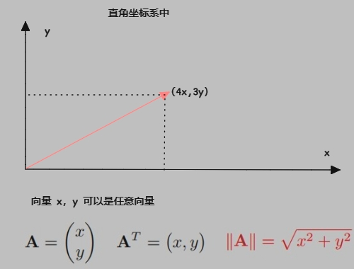
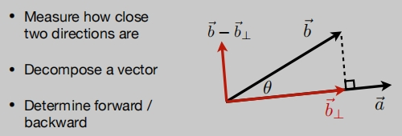
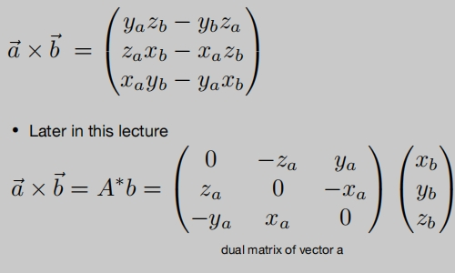
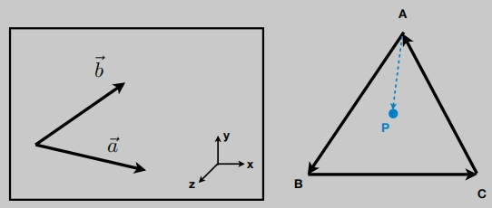

# 线性代数

涉及的学科有：
- 基础数学：线性代数、统计学、微积分；
- 物理：光学、力学、波动光学；
- 信号：信号处理、数值分析；
- 美学；

更依赖于线性代数
- 向量（点积、叉积等）
- 矩阵（矩阵-矩阵、矩阵-向量多重等）
  > 点是向量 （？），
  > 平移或旋转对象等操作，可以是矩阵向量乘法

## 向量

$$ 
向量的大小（长度），写为|| \vec{a} ||
$$

## 单位向量
$$ \hat{a} = \frac{1}{||a||} \vec{a} \    用于表示方向 $$ 

## 向量的加法
几何上：可以使用平行`四边形法则`或者`三角形法则`。

模长：

## 点乘
点乘的结果是一个`数`。
‌
> 向量点乘可以快速算出两个向量的`夹角余弦`、`夹角`。

点乘的运算性质：满足交换律、结合律、分配律。
‌

具体运算：
‌

## 点乘在图形学中的作用
- 找到两个方向（向量）之间的夹角。
  > 如：在光照模型中，光源照的方向，光照法线，反射，摄像机视角等它们之间的夹角。
- 一个向量投`影到`里一个向量上。
‌
‌
  > 计算投影距离。
  >
  > 分解向量。
  >
  > 在图形学中，点乘还可以计算两个向量有多么接近（根据点乘结果）。
  >
  > 通过点乘可以知道`前与后`的信息。
  > ‌

## 叉乘
‌
- 叉乘可以得到一个新的向量，该向量垂直于做叉乘的两个向量。
- 这个新向量的方向，由`右手（螺旋）定则`决定。（该文档以右手定则为例）
- 可用于建立三维直角坐标系。

叉乘的运算性质：
‌

具体运算：
‌

## 叉乘在图形学中的作用
- 判定左右（顺时针、逆时针）
- 判定内外（都为左或者都为右）
  > 向量叉乘，得到的一个新向量，利用它的正负去判定。（做光栅化的基础）
‌

**定义一个右手定则的三维坐标**：
‌

## 矩阵

**矩阵与矩阵相乘**
‌

**矩阵与矩阵相乘的运算性质**
‌

矩阵应用：如何将一个向量变换为它的y轴镜像
‌

