# 三维图形变换

## 三维空间变换
**矩阵表示**：

**缩放变换、平移变换矩阵**
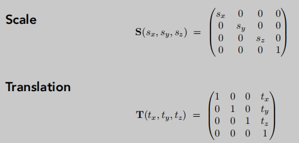

**旋转变换矩阵**（三维空间中最复杂的变换）

**任意角的旋转**
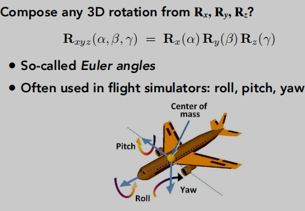

**罗德里格斯的旋转公式**
> 旋转轴默认过远点

> 对任意旋转变换，给出一个旋转矩阵。

当我们想要围绕某一个点旋转
> 先将这个移到原点。
>
> 在进行旋转。
>
> 在将所有的变换恢复到原来的点。

**罗德里格斯的旋转公式推导**

**四元数**
用于旋转与旋转的差值计算。（旋转矩阵不适合做差值计算）

## 三维变换
- 视图变换
- 投影变换
  - 正交投影
  - 透视投影

什么是视图变换？
:::info 拍一张照片的流程
1. 布置好拍照场景，人和物（`model` transformation）
2. 找一个角度，布置相机的位置(`view` transformation)
3. 拍照!(`projection` transformation)

`  模型变换-视图变换-投影变换`
:::

## 视图变换/相机
**定义相机**

**约定相机的初始位置** 
- 原点：（0，0，0）
- 朝向：-Z
- 向上方向：Y
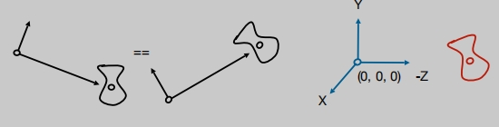

**如何初始化相机的初始位置**？
一 一对应
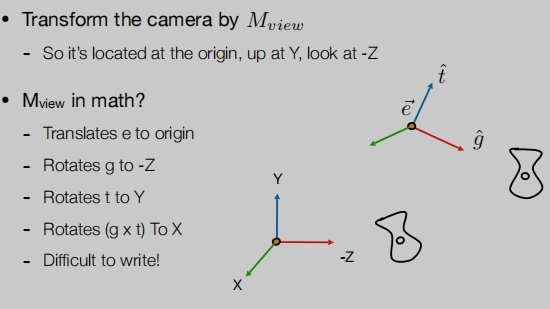

相机初始化写成矩阵的行式（先平移再旋转）
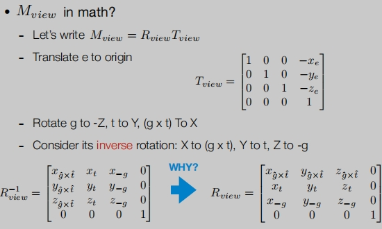

视图变换：相机为了设置为一个约定位置，其他所有的物体也要跟着变换，保证相机与物体保持不变。
> 视图变换操作的是相机，物体模型要跟着变换，做相对运动。 
>
> 模型变换与视图变换经常在一起，被称为`模型视图变换`。

## 投影变换
- 3D 到 2D
- 正交投影
- 透视投影

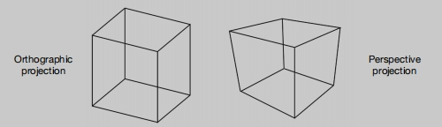

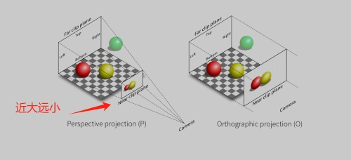

## 正交投影

一种简单的做法是:
> 相机位于原点，看着-Z，Y向上。
>
> Z 降维。
>
> 变换生成的矩形扩展为二维矩阵。

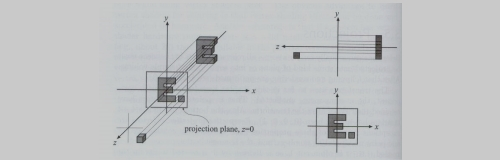

还有一种标准的做法是：
> 把一个长方体映射到“典型的（正则、规范、标准）”立方体。
>
> 通过转换中心长方体。
>
> 通过转换中心长方体。

先平移（中心到原点），后缩放（长度/宽度/高度到2）
> 为什么是2，因为是从中心原点向正负坐标各延申1个单位长度。

> 因为我们是沿着-Z方向看，所以 `n > f`。
>
> 这与左/右定则有关。

## 透视投影
- 最常见的是计算机图形学，艺术，视觉系统。
- 满足近大远小。
- 平行的直线将不再平行，收敛于单点。

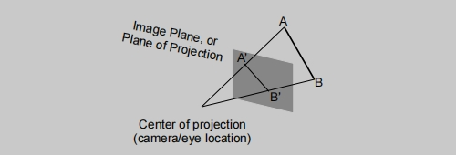

**回顾齐次坐标**：
>（x、y、z、1）、（kx、ky、kz、k != 0）、（xz、yz、z2、z != 0）在3D中都表示同一点（x、y、z）

透视投影分为两步：
1. 先像远平面挤压到近平面。
2. 再进行正交投影。

挤压步骤：
> 近平面不变。
> 
> 远平面Z 值不变，只是向近平面收缩。
>
> 远平面的中心点不变。

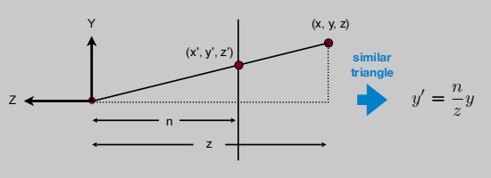
> 这描述的是Y，X是同样的道理。
> 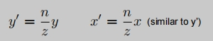

挤压用齐次坐标表示：
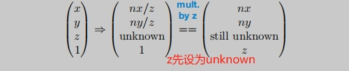

求变换矩阵：

> 变换矩阵的第三如何求呢？观察挤压步骤发现：
>
> ①、近平面上的任何一个点都不会改变。
>
> ②、远平面上的任何一个点的z都不会改变。
>
> ③、远平面的中心点不变。

根据上面①、② 可以得到变换矩阵的第三行前面两个：（0 0 A B）

再根据 ③ 可以求出A 和 B

