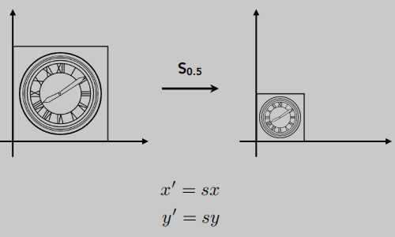
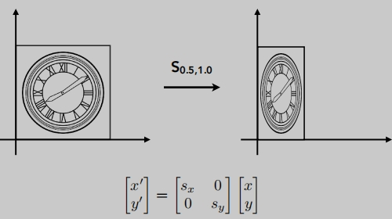
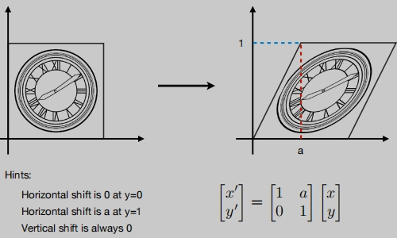
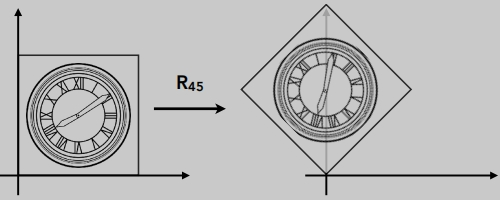
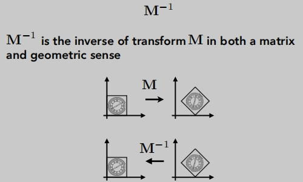
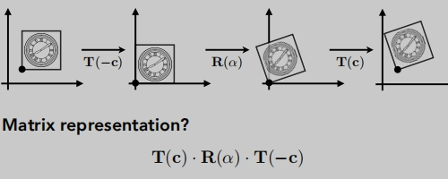
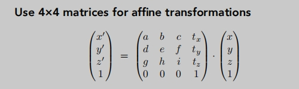

# 变换

## 什么是变换

三维成像（三维投影到二维）

变换的应用：
- 投影成像
- 动画

## 二维变换

将矩阵与变换关联起来。

## Scale（缩放变换）

**缩放矩阵**：

**反射矩阵**（镜像）

**切变矩阵**

## Rotate（旋转变换）
默认是绕着原点旋转（0,0），逆时针方向。

**旋转矩阵**（必需自己能推导）

:::tip 注意旋转角度的正负
$$
正 \theta 角度 R_{\theta} = 
\begin{pmatrix} 
cos\theta & -sin\theta \\
sin\theta & cos\theta \\
\end{pmatrix}
$$

$$
负 \theta 角度 R_{-\theta} = 
\begin{pmatrix} 
cos\theta & sin\theta \\
-sin\theta & cos\theta \\
\end{pmatrix}
= R_{\theta} {}^T
$$

$$
\begin{matrix} 
根据定义，旋转负的 -\theta 角度，恢复原来的样子，刚好等于旋转正\theta 角度，他们的操作是互逆\\ R_{-\theta} = R_{\theta} {}^-1 = R_{\theta} {}^T
\end{matrix}
$$

:::

## 线性变换
- 他们的共同点：可以通过线性变换得到变换后的坐标。（将`变换`与`矩阵`关联起来）。
- 对于变换就用矩阵来表示：`矩阵乘以向量`的行式。

## Translate（平移变换）

写成矩阵的行式：

- `平移变换`无法直接使用`矩阵乘以向量`的行式来表达。
- 然而我们也不希望`平移变换`成为`特例`。
- 是否存在一种统一方式来表达所有变换---> 解决方案：`齐次坐标`。

## 齐次坐标

- 添加一个维度的坐标轴。

齐次坐标下的`平移变换`以`矩阵乘以向量`的行式：

齐次坐标下所有的变换操作依然是有效的

## 仿射变换

线性变换（缩放、旋转）+ 平移变换 统称为 `仿射变换`。

`仿射变换`的`矩阵乘以向量`行式：

`仿射变换矩阵`

##  逆变换

在线性变化中等于乘以它`变换矩阵`的 `逆矩阵`

## 组合变换

`先旋转`还是`先平移`？结果是不一样的。

> 这与`矩阵的不满足交换律`的概念是一致的。

## 组合变换矩阵的运算顺序
给向量添加变换时，一般是`左乘一个变换矩阵`，总体的运算顺序是`从右到左`。

## 组合变换的推广
预乘n个矩阵，得到一个表示组合变换的单一矩阵

## 分解变换

## 三维变换

齐次坐标`三维变换``矩阵乘以向量`表示

视图、投影（正交、透视）变换，总称为**观测变换**。