# 抗锯齿（反走样）

**抗锯齿**
- 抽样法理论，抽查法理论
- 在实践中抗锯齿

可见性/**闭塞性**
- Z-缓冲

## 采样原理
**采样在计算机图形学中是普遍存在的做法**。

照片：样本图像传感器平面上的`采样`。

视频：本质上是在`时间`上的`采样`。

**采样所产生的问题同样也是广泛存在的**。

Artifacts：
> 计算机图形学中：采样存在错误/混乱/不准确等等这些问题。

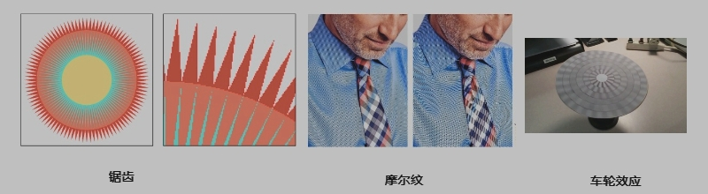

出现采样 Artifacts 的原因是：**信号变化太快（频率较高），但采样速度过慢导致**。

下面让我们深入研究基本原因，看看如何实施反锯齿栅格化。

## 采样产生`Artifacts`的原因
回顾正弦余弦：

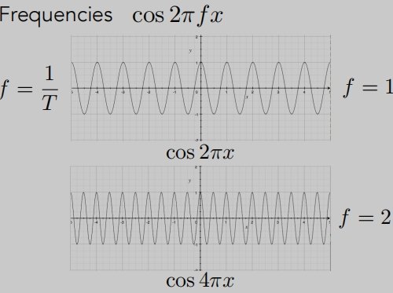

**傅里叶变换**：
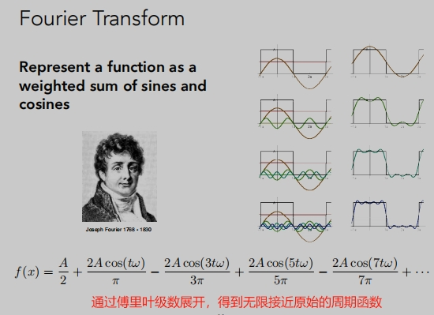

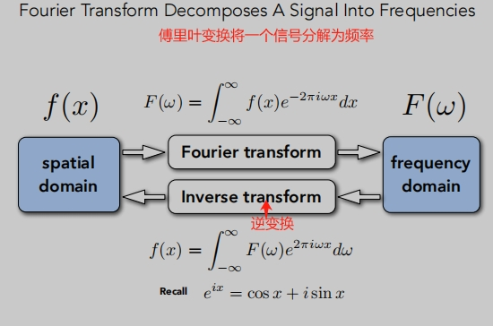
> 这里傅里叶变换其实就是将函数变成不同频率段，并且将它显示出来。

**更高的频率需要更快的采样**

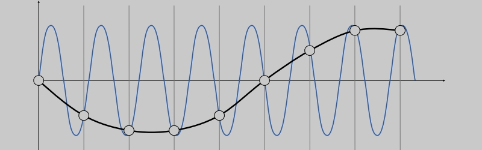
> 高频信号的采样不足：样本错误地似乎来自一个低频信号。
>
> 在给定的采样率下无法分辨的两个频率被称为"走样"。

这里就在频率的分析上我们就了解了什么是“走样”。

## 滤波
傅里叶变换，可以把一个函数从`时域`变到`频域`。

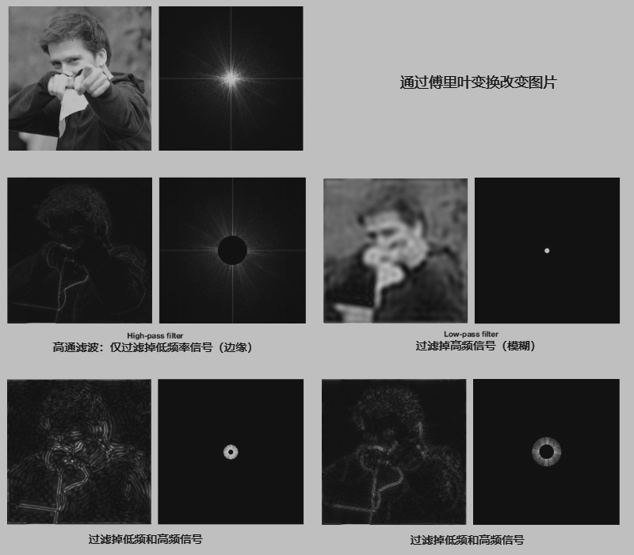

## 卷积（图形学中）

Filtering = Convolution = Averaging （滤波 = 卷积 = 平均）

> 时域的乘积 = 频域的卷积

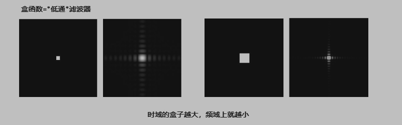

## 采样=重复频率内容

从频率的角度来看为什么会走样：
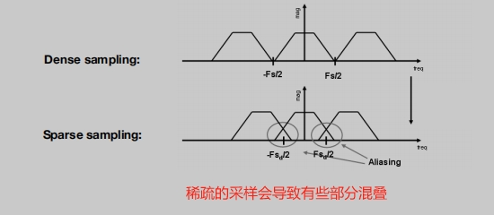

## 抗锯齿（反走样）
**减少混叠**
增加采样率：
- 本质上是增加了傅里叶域中副本之间的距离。
- 更高分辨率的显示器，传感器，框架缓冲区。
- 可能需要非常高的分辨率。

抗锯齿（反走样）：
- 在重复之前使傅里叶内容“更窄”。

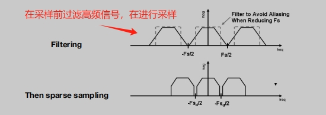
> 在采样前过滤掉高频信号，再进行采样。

**抗锯齿（反走样）取样**：

> 注意栅格化三角形中的抗锯齿边，其中像素值取中间值。

如何将三角行变模糊呢？
- 使用1像素宽的框滤波器（低通、模糊）

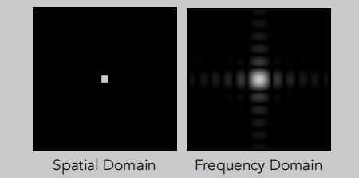
> 通过1像素的f（x、y）框模糊（卷积=滤波=平均）。
> 
> 然后在每个像素的中心进行采样。

通过平均像素值计算消除锯齿：

## 超采样 --（MSAA）

通过对一个像素内的多个位置进行采样并平均其值，近似1像素盒滤波器的效果：
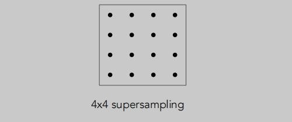

超采样步骤：

## 快速近似-- FXAA (Fast Approximate AA)

原理：先进行光栅化，然后对图像进行处理，通过图像匹配的方法找到锯齿部分，再通过算法处理掉。

## TAA --  (Temporal AA)
原理：在时间范围内通过相邻帧数的像素感知是否在三角形内。复用上一帧的感知结果。

1. 在更高分辨率下渲染当前帧：TAA 通常使用更高的分辨率（例如 2x 或 4x）来渲染当前帧。这可以提供更准确的采样场景。
2. 执行多重采样：TAA 使用多重采样（MSAA）在高分辨率缓冲区中对每个像素进行多个取样。这有助于减少锯齿伪影。
3. 解析样本：在渲染当前帧后，TAA 将多个样本解析为单个像素值，以便在较低分辨率的缓冲区中每个像素都只有一个值。这是通过使用“重投影”或“运动矢量”来完成的。
4. 将当前帧与先前帧混合：TAA 将解析的像素值从当前帧与相应的先前帧像素值进行混合。这是通过使用“加权平均”或“lerp”来完成的。混合系数由当前帧和先前帧之间的运动量确定。
5. 显示最终图像：混合的像素值随后在屏幕上显示，从而有效地减少锯齿伪影。

## 超分辨率/超采样
- 从低分辨率到高分辨率。
- 本质上仍然是解决“样本不够”的问题。
- DLSS（深度学习超级采样）。
