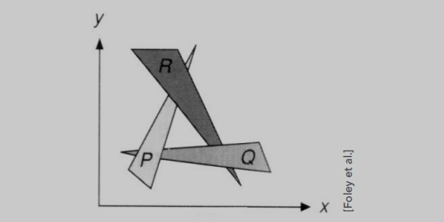
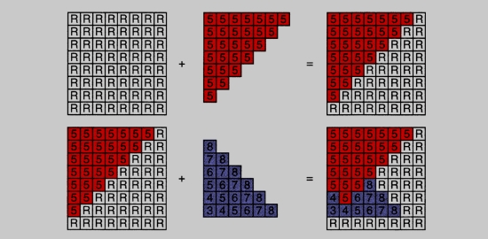

# 光栅化的可见性/闭塞性

## 可见性/闭塞性
- 使用深度缓存/缓冲

## 画家的算法

- 其灵感来自于画家的绘画方式。
- 先远后近，近的图形可以覆盖远图形的。（顺序很重要）
- 需要进行深度排序（n个三角形的O（nlogn））

> 而出现这种复杂的情况时（环），实际做法中种画家算法就无法适应了（无法定义他们的深度关系）。因此出现了 `Z-Buffer`算法

## Z-Buffer（深度缓存/缓冲算法）

- 无法对三角形的深度关系定义，但可以对每`一个像素的顺序`进行排序。
- 用一个额外的缓冲区来存储深度值：
  > frame buffer： 当前的场景信息（最后的结果）。
  >
  > depth buffer： 当前场景每个像素的深度。

:::tip
为简单起见，我们假设z（深度）总是正的：它就是物体到相机的距离，越小的距离表示越近，越大的距离表示越远。
:::

## Z-Buffer 算法
初始化深度缓冲器为∞，栅格化期间：

示例

> 惰性覆盖：当深度缓存相同时，不会覆盖，沿用已有的深度。

## Z-Buffer 算法复杂度

- n个三角形的O(n)（假设覆盖范围不变）
- 它有一个非常好的性质，它与顺序是没有关系的。