# 光栅化

- 不同的光栅显示。
- 重新调整三角形。

## 定义视锥体

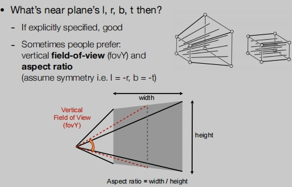

需要定义的参数：
> 长宽比：aspect ratio
>
> 垂直可视角度：field-of-view (fovY)
>
> 水平可视角度：可以根据长宽比，从相机到左右两边中点的连线得到。

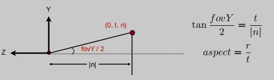

## 如何绘制到屏幕上

在做完MVP之后，绘制到屏幕。
- M-模型变换（放置对象）
- V-视图变换（放置照相机）
- P-投影变换
  - 透视投影
  - 正交投影

什么是屏幕：
> 像素数组。
> 
> 阵列的大小：分辨率。
> 
> 一种典型的光栅显示器。

什么是光栅:
> 德语中的光栅==屏幕。
> 
> 光栅化 == 绘制在屏幕上。

什么是像素:
> 在图形中，一个像素是一个颜色均匀的小方块。一个像素内颜色不会发生任何差异。
>
> 颜色是（红、绿、蓝）的混合物。

## 定义屏幕空间
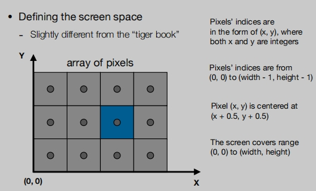
这里的像素从0开始：上图蓝色像素点为（2，1）：
> 像素值是（x，y）的形式，其中x和y都是整数。
>
> 像素范围是从（0、0）到（width-1、height-1）。
>
> 像素点（x，y）位于（x + 0.5，y + 0.5）的中心。
>
> 屏幕覆盖范围（0、0）到（width、height）。（一个像素覆盖1）

把物体变换到 `width*height` 的屏幕中：
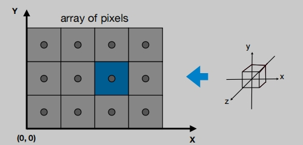
> 先不管Z轴。

变换矩阵为：
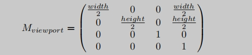

## 电视光栅显示CRT

## 三角形绘制

为什么使用三角形？
- 最基本的多边形。（可用于分解其他多边形）
- 保证是平面的。
- 定义良好的内部。（很好判定内外）
- 明确的三角形上的顶点插值方法。（重心坐标插值）

**如何将三角的覆盖的区域绘制称为像素点**？

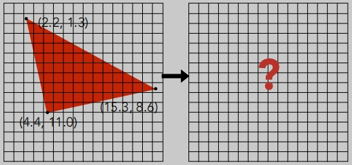

## 采样
- 在一个区域内，通过一个连续的函数，不停的去访问各个点的值。
- 采样就是把一个函数离散化的过程。
- 采样是图形学中的一个核心思想。
> 我们取样时间（1D）、面积（2D）、方向（2D）、体积（3D）

**定义inside二进制函数判断任意坐标（x,y）是否在三角形内**：

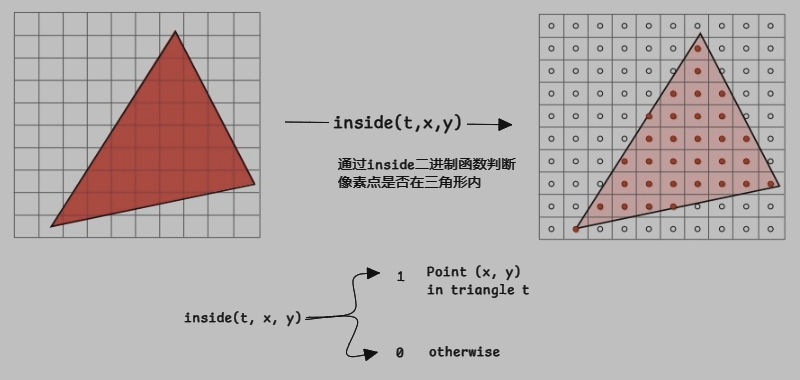

而我们的采样就是，在屏幕空间中（这里是整个屏幕），定义的`inside函数`在不同的像素中心，确定这个函数的值是1还是0（然后标记不同的颜色）。

**像素的中心**：（需要加0.5）

**采样函数**：去遍历所有的点
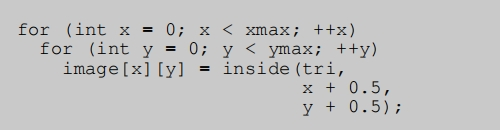

**inside函数判断一个点是否在三角形内**：通过`向量叉乘`可以得到。

特殊情况：要么不处理，要么严格规定判断规则。

**光栅化优化**：

采样优化方法一
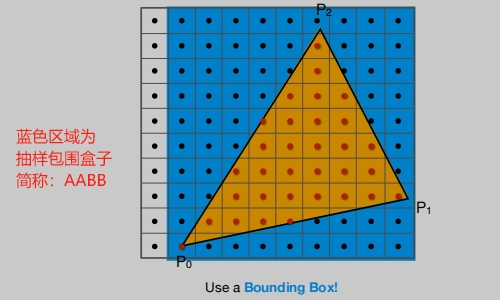
> 通过三角形的顶点缩小采样范围。不需要进行整个屏幕像素的遍历。

采样优化方法二
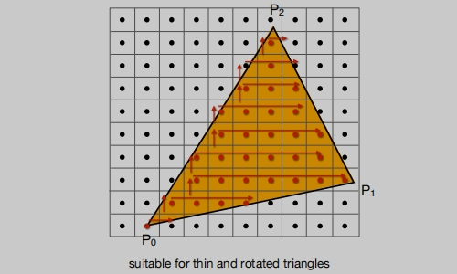
> 三角形每一行的最左和最右的，形成的包围盒。（这并不容易）

## 锯齿问题
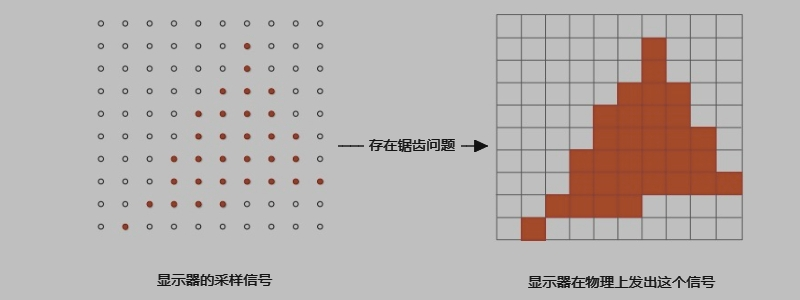