# 纹理映射

**纹理**：是物体表面的特征信息。
> 它可以是任何类型的图像、图案或模式，可以是静态的也可以是动态的，用来添加细节和丰富物体的外观。

**材质**：是物体本身的物理信息。
> 如：颜色、光泽度、透明度、反射率和折射率...

**着色**：对不同的物体应用不同的材质的这么一个过程。

## 着色器程序
- 程序顶点和片元处理阶段。
- 描述在单个顶点（或碎片）上的操作。

> 着色器函数对每个片段执行一次。
>
> 输出在当前碎片的屏幕样本位置的表面颜色。
>
> 此着色器执行纹理查找以获取此时曲面的材质颜色，然后执行漫反射照明计算。

[着色器 - 传送门](http://shadertoy.com/view/ld3Gz2)

着色器是一门值敬畏的语言，可以做出非常震撼的效果。

## 纹理映射（纹理贴图）
在三维空间中，每个三维曲面点在2D图像（纹理）中也有一个位置。

应用于曲面的纹理：

> 三维中的三角面，纹理中有对应的图形。

## UV坐标
每个三角形顶点指定一个纹理坐标（u、v）
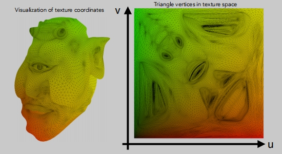
> 绿色：v方向
> 
> 红色：u方向

**UV坐标的可视化**

好的纹理设计能无缝衔接。

如果知道三角面的三个顶点的uv坐标，如何知道三角形内部每个像素的uv 坐标？
> 可以通过插值的方式获得（利用重心坐标）

## 重心坐标

如何在三角形内部任意插值？为什么要在三角形内部插值？
> 当我们知定顶点处的值，我们希望获得三角形内部的值。
> 
> 并且在三角形内部获得平滑过渡的值。

可以插值什么内容？
> 纹理坐标，颜色，法向量 ……。

怎么做呢？
> 利用重心坐标。

- 重心坐标是定义在一个三角形内部的。
- 在三角内任意点与三个顶点的关系都可以表示成为一个线性组合：（x，y）= α A + β B + γ C
- 满足 α + β + γ = 1 ，α，β，γ 是三个非负数。当知道其中两个数后，就能得到第三个数。

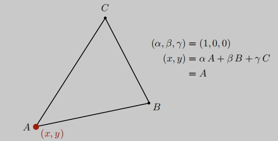
A点可以写成：
> (α, β, γ) = (1, 0, 0)
>
> (x, y) = α A + β B + γ C = A

**重心坐标也可以通过面积比求出**

三角形的重心点（通过面积求坐标）

**重心坐标计算公式**：

**应用重心坐标做插值**：

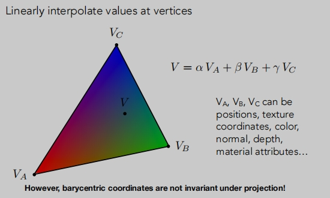
> 重心坐标插值可以是：位置、纹理坐标、颜色、法线、深度、材质属性...

:::tip 注意
重心坐标，在投影下会得到不一样的重心坐标。

如果我们想要插值三维空间中的属性，我们就应该取三维空间的中的顶点坐标，进行重心坐标计算和插值，而不等投影完成后。
:::

## 纹理映射过程

- 对于任意一个点（x,y），可以使用`重心坐标`计算出它的`uv坐标`。
- 在纹理上查询uv坐标的值: `texcolor = texture.sample(u,v)`
- 然后对该点的值进行处理。

## 纹理太小
纹理上的像素：纹素 / 纹理元素（texel）

如果纹理太小怎么办？（高像素的物体，低像素的纹理）

> 纹理太小了，就会被拉大。
>
> 物体上每一个像素点我们都可以找到它对应的在纹理上的位置，但是在纹理上它可能不是整数，我们会把他四舍五入成为整数（0.4 = 0，0.6=1），在一定范围里，我们认为查找的是相同的纹理像素。
> 当纹理太小时，一定范围里的 pixel（3 * 3 或者 5 * 5） 会映射 同一个 texel。此时就会产生锯齿。

如何解决这一问题？

当我们在查询纹理坐标的时候，如果获取到的是非整数坐标，我们要求取它的值，使得纹理更平滑。---- 使用`双线线插值`。

**双线性插值**

线性插值：
> lerp(x, v0, v1) = v0 + x(v1 − v0) （求 x 往哪个值靠近）
>
> 假设v0, v1分别是0，1，x 就是0-1之间的值。
>
> 当x = 0 的时候，x = v0；当x = 1 的时候，x = v1。

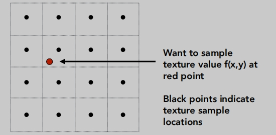

双线性插值 
在水平方向和垂直方向做线性插值。

> 此时得到的纹理颜色就是周围四个点颜色的平均。

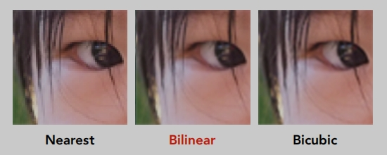
> Nearest 四舍五入的方式
>
> Bilinear 双线插值的效果
>
> Bicubic 双线三次 （取周围16个点，运算量大，但精细）

## 纹理太大

出现了 什么问题呢？ 
> 远处摩尔纹
> 
> 近处锯齿（走样）

怎么产生的呢？
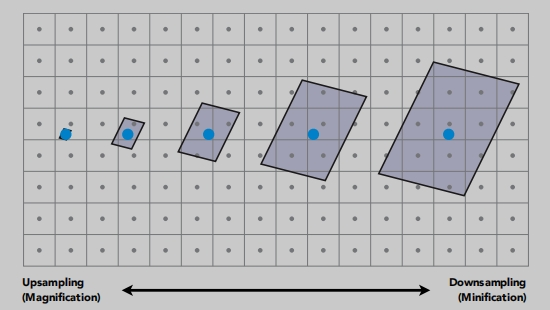
>屏幕中，每个像素对应的纹理大小是各不相同的。
>
> 有的一个`像素`占用了很大一块`纹素`（如：1个像素点，在9个纹素点采样）
>
> 一个像素在一个很大区域的纹素中取平均，这个平均无法代表这个区域的纹素的。这会导致与上一个像素采样的不连续。

**总结：像素 与 纹素 采样频率无法很好的匹配。（有的需要高频，有的需要低频）**

超采样会的效果怎样呢？
- 质量高，但是昂贵。

让我们用另一种方式来理解这个问题：
- 如果我们不采样会怎样？
- 如果我们能立刻知道一个范围内的平均值即可。

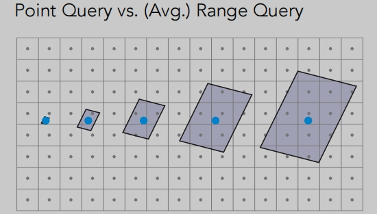
> 这里就牵涉到 点查询、范围查询的问题。
>
> 图形学中用`Mipmap`来解决范围查询这一问题。

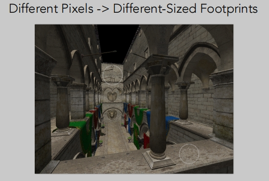
假设应用的是相同的纹理：
> 近处的像素对应的纹素范围就小。
>
> 远处的像素对应的纹素范围就大。

## Mipmap
Mipmap的特点：
- fast：图形学中用`Mipmap`来解决范围查询，非常的快。
- approx：近似（不是正确的）
- square：方形。

Mipmap只能做`近似的`、`方形的`、`快速的`范围查询。

> 把一个纹理图片分成了多份。

图像金字塔
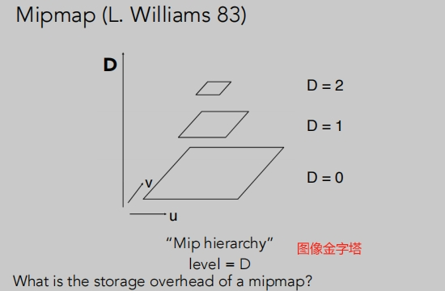
> Mipmap新增的存储开销比原来多了`三分之一`。

我们要用Mipmap做一个近似的在正方形区域内做范围查询，且立刻要得到区域内的平均值是多少。
> 任何一个像素都可以映射到一个纹理区域，这个区域我们要如何得到呢？我们可以用`近似`方法得到。

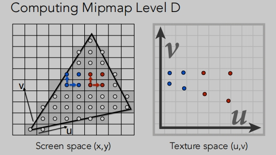
> 使用相邻像素样本的纹理坐标来估算纹理大小。（这里其实就是在一个“近似”）

这里非常有意思：
> 上面的做的“近似”，其实就是在计算，一个像素，在纹理中所占纹素大小。
>
> 1个像素在屏幕中相当于是最小单位，“近似”做的事情就是将，`单位像素` 类比为 `单位纹理`----个人理解。

在做完“近似”之后的正方形，我们如何根据我们之前预计算好的`Mipmap`进行查询这个正方形纹素区域的平均值呢？
> 假设这个区域的大小是1像素，对应1*1个纹素，此时我们需要去`原始的纹理图层(D0)`中去找到这个对应的位置(一一对应)。
>
> 假设这个区域的大小是1像素，对应4*4的纹素，此时我们需要去`第三层纹理图层(D2)`中去找到这个对应的位置(一一对应)。
>
> 具体层级 D = log2 L 。

**不连续性问题**：

> 不连续性是应为Mipmap 只存在整数层，不存在小数层。
>
> 我们无法知道0.5层，0.8层对应的 Mipmap图层的值是什么？
>
> 三线性插值解决这个问题。

**三线性插值**
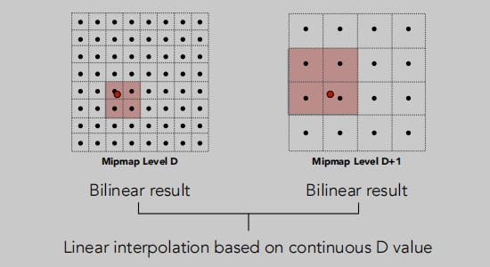
> 它可以得到非常平滑的值
>
> 首先它是做了相邻层级的区域查询，将其查询结果分别进行双线性插值
> 
> 把相邻层级的两个双线插值结果合在一起。
>
> 然后再层与层之间再做插值。（在双线插值的基础上加了一层线性插值 = 三线性插值）
>
> 此时同过相同计算，我们就可以在任意层（管他是整数层，还是浮点数层）去查询它的值。

**三线性插值的效果**

**三线性插值的开销**：并不大。
> 做两次查询。
>
> 一次插值。

## 各向异性过滤
Mipmap trilinear sampling 真的完美了吗？
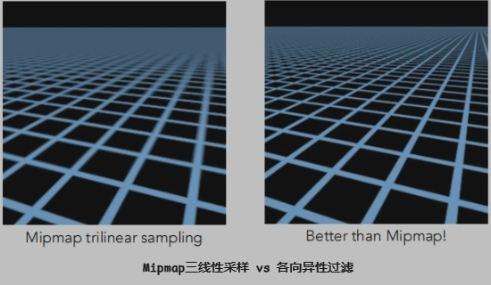
> Mipmap三线性插值： 远处的像素糊掉了。
>
> 各向异性过滤： 效果会好一些（各向异性过滤可以解决部分问题，任然存在一些问题）。
>

各向异性：在不同方向上，它的表现各不相同。（水平和垂直方向上的表现完全不相同）
- 在水平和垂直方向上进行压缩。

> 从水平方向看，高度不变。
>
> 从垂直方向看，宽度不变。
>
> `Mipmap`只是`各向异性过滤`对角线上的压缩，各向异性过滤比Mipmap多了是不均的水平方向和垂直方向的压缩。
>
> 将压缩的图片恢复到原来的图片，通过做这样的预计算，我们可以非常快查询到原始对应的图片被压缩后的矩形区域，而不是限制在Mipmap的正方形。

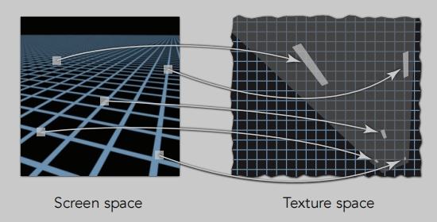
> 各向异性过滤对于矩阵区域可以快速的范围查询（比Mipmap好），不用限制在正方形区域，对于非矩阵的也没能解决。

**各向异性过滤开销**：是原来的三倍。

只要显存足够，各向异性过滤对应用的性能几乎没有什么影响。

**EWA过滤**：
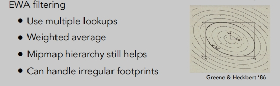
> 效果好，代价是开销大。

## 纹理应用
在现代gpu中，纹理=内存+范围查询（过滤），不要把它局限于图片，可以把它理解成数据。

环境贴图
> 来自环境的光线与环境一起渲染。

环境照明
> 环境贴图（左），用于渲染真实的照明。

可以把`球面环境图`记录下来，并且可以展开。

**Spherical Map**

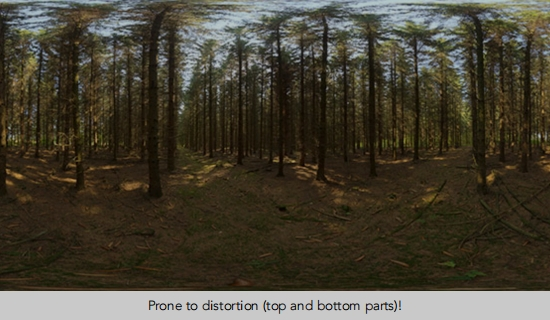
> 容易变形（顶部和底部部分）被极度压缩。
>
> 这里就有了 `Cube Map`来解决 被压缩这一问题。

**Cube Map**
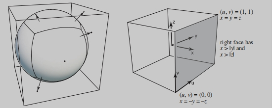

## 法线贴图（凹凸贴图）
人为的在任意点做一些虚拟的法线出来，通过纹理映射，得到凹凸不平的效果，物体几何本身是没有任何变化的。

> 假设左上的贴图：黑色部分为0，白色部分为1。
> 
> 根据这些信息我们可以在这些位置重新构造出虚拟的法线，通过纹理映射得到凹凸不平的阴暗效果。

**法线贴图具体做了什么事情**？

通过`法线贴图`添加曲面细节，而不添加更多的三角形，不会对原本的几何做改动。
> 把任一像素的法线做一个绕动，通过定义临近位置的高度差，来重新计算它的法线。
>
> 应用`法线贴图`它会告诉我们高度位置会如何变化。（p的位置被向上移，法线指向n）

**二维示例中：`法线贴图`如何计算法线**
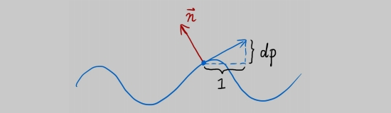
> 假设原本是平面P点，蓝色的曲线是`法线贴图`定义出来的。原本的法线为（0，1）
> 
> p点的`切线`计算为：p处的导数 dp = c * [h（p+1）- h (p)]
>
> 它的法线垂直于切线，把切线逆时针旋转90度就能得到它的法线。

**三维中法线贴图**

- 原始表面法线n (p) = （0，0，1）
- uv方向的切线：
  - dp/du = c1 * [h(u+1) - h(u)] 
  - dp/dv = c2 * [h(v+1) - h(v)]
- 法线为 (-dp/du, -dp/dv, 1).normalized()
- 请注意，这是在本地坐标中进行的！

## 位移贴图
位移贴图是 法线贴图（凹凸贴图）一种更高级的做法。
- 位移贴图实际上是真是的改变了各个顶点的位置信息。
- 位移贴图对模型的三角面足够细致。

> 可以从贴图边缘，和物体投影看出差异。

如果一个物体模型三角面没有那么细致，能使用位移贴图吗？
`DirectX`（windows）提供了`动态曲面细分`方法。

## 三维噪声函数
纹理可以是三维的

> 这里并没有二维纹理图像，而是定义了一个三维空间的噪声函数。
>
> 三维噪声函数还可以应用在山脉的起伏高度。

## 预先计算纹理
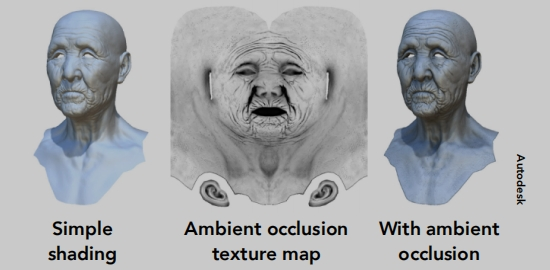
> 把很多计算提前去做，做完了再去应用它，就会非常快了。
>
> 就是利用纹理去记录一些提前计算好的信息。

## 三维纹理和体积渲染
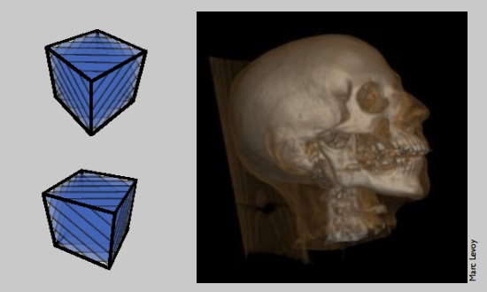
> 如：通过核磁共振扫描得到一些三维的信息（组织的密度...），然后渲染出这些信息。
