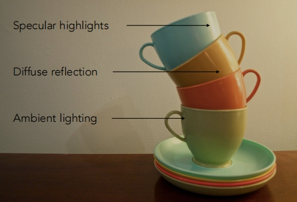
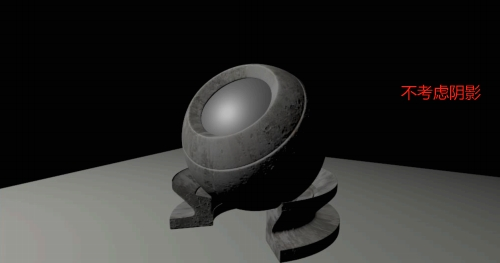
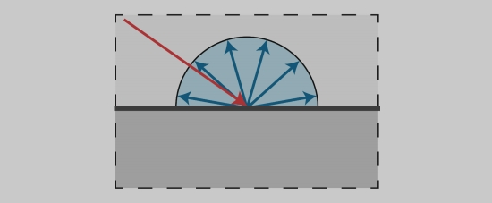
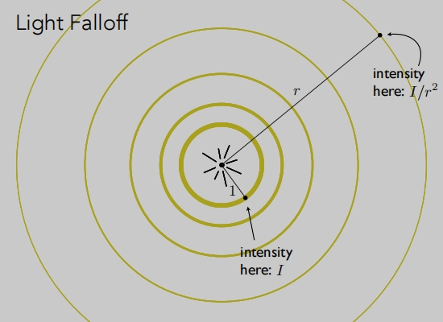
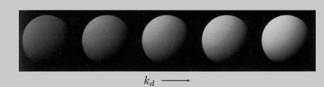
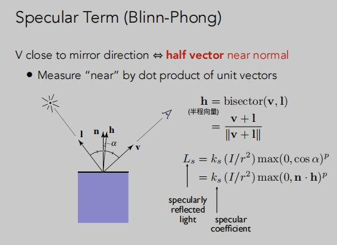
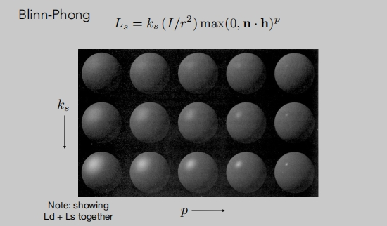
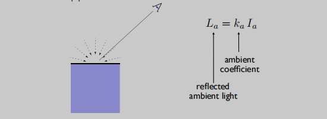
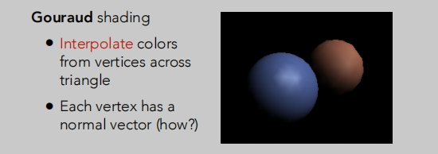
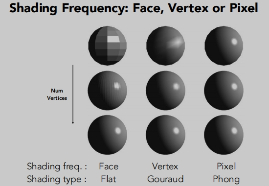

# 着色

在图形学中什么是着色？

**对不同的物体应用不同的材质的这么一个过程**。

## Blinn-Phong反射模型

- 它是一个经验模型，并不完全符合真实世界中的光照现象，但由于实现起来简单方便，并且计算速度和得到的效果都还不错，因此在早期被广泛的使用。

> 高光
>
> 漫反射：如墙体
>
> 环境照明

## 如何定义材质

需要先定义：
> v 观测方向（单位向量）
>
> n 法线（单位向量）
>
> l 光照方向（单位向量）
>
> 物体表面参数（颜色、光泽度...）

着色只考虑物体的局部性。（不考虑物体阴影 shading ≠ shadow）

## 漫反射
当光线到达物体表面的某一个点时，会被均匀的反射到各个方向上去。

`单位面积`物体漫反射接受的能量收什么影响？

> 它遵循`兰伯特余弦定律`。

**兰伯特余弦定律**
`光照方向`与`法线方向`它们之间的`夹角的余弦`成正比。

**能量的衰减**

**漫反射的计算**

> 受物体表面颜色对能量的吸收情况影响
>
> 受能量传播距离衰减情况影响
>
> 受`光照方向`与`法线方向`它们之间的夹角大小影响。

## 高光
- 物体反射方向接近于镜面的反射的方向。
- `观察的方向`接近于`镜面的反射方向`时可以看到高光。

有一个更聪明的做法 `Specular Term (Blinn-Phong)`
> 半程向量 比 反射向量 更好计算。

**镜面反射项 Specular Term (Blinn-Phong)**

半程向量：光线方向与观察方向夹角一半方向上的一个单位向量（v 于 l 中间的单位向量）。
> `当观察方向` 与 `镜面反射方向`接近时（v与l），`法线方向` 与 `半程方向`接近（n与h）。
> 
> 受镜面反射系数影响。
>
> 受能量传播距离衰减情况影响。
>
> p 余弦指数。（在夹角余弦添加一个系数（100-200），用于控制高光点的大小）
> 

示例

## 环境光
- 假设物体接受的来自四面八方的环境光都时相同的。
- 假设它是一个常数。
- 实际环境光是非常复杂的。

> Ka 环境系数。
>
> Ia 环境光的强度。

## Blinn-Phong反射模型的组成

**Blinn-Phong反射模型** = **环境光+漫反射+高光** （简化模型）

## 着色频率

**基于三角面着色**（flat shading）

> 计算三角面的法线，然后对三角面进行着色。

**基于顶点着色**（Gouraud shading）

> 计算三角形每个顶点的法线，对每个顶点做一次着色。
> 
> 每个顶个对应的三角形，三角形内部的颜色通过插值的方式计算。

**基于像素点着色**（Phong shading）

> 计算三角形每个顶点的法线，在三角形内部每个像素插值处法线方向。
>
> 再对每个像素进行一次着色。

**着色方式的选择与模型本身的面、顶点、像素有关**。

这里每一行的模型一样，每一列的着色方式一样。
> 当模型本身的频率足够高时，就看选择（flat shading）。
>
> 根据模型情况也可选择（Gouraud shading）。
>
> （Phong shading）着色往往是开销最大，但最精细。

## 顶点法线

> 顶点相邻面的法线求平均，得到顶点法线。
>
> 由于顶点对应的面大小不一，对相邻面面积大小加权到法线，再求平均效果更好。

## 像素法线

> 根据顶点法线，插值出每个像素的法线（重心坐标）。
