## 几何的曲线

这里主要描述的是`显示的几何`。前面的说的隐式几很多的表示方法，显示几何同样也有很多表示方法。

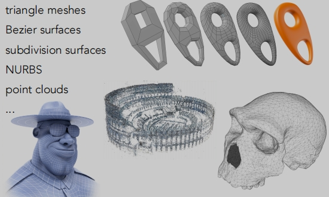
> 三角面
>
> 贝塞尔曲面
>
> 细分曲面
>
> 点云

## 点云表示几何（显示几何）
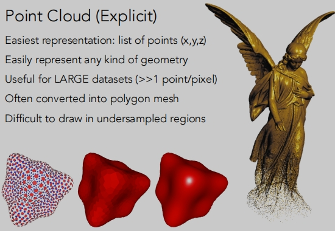

- 最简单的表示：点列表（x、y、z）。
- 易于表示任何类型的几何图形。
- 适用于大型数据集（>>1点/像素）。
- 经常转换成多边形网格。
- 很难在采样不足的区域中绘制出数据（缺点）。

## 三角面/多边形表示几何（显示几何）
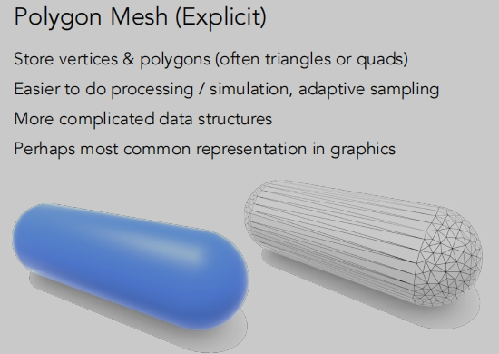
在图形学中应用最为广泛的。
- 存储顶点和多边形（通常是三角形或四形）
- 更易于进行处理/模拟，自适应采样
- 数据结构更复杂
- 是图形中最常见的一种表示

**在计算机中三角形面如何形成物体的**（.obj格式文件）
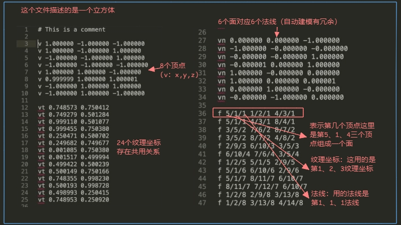
> 定义好顶点、纹理坐标、法线后然后定义他们之间的连接关系。

## 贝塞尔曲线表示几何（显示几何）

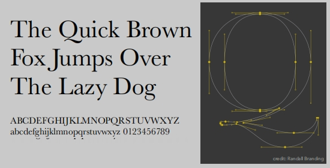

> 用一系列的`控制点`去定义曲线。`控制点`它会定义曲线满足一些性质
> 
> 一开始沿着P0 到P1 往前走，最终会在P3结束。并且在结束的会沿着P2 到 P3往外走。

**如何画出一条贝塞尔曲线**？

## 二次贝塞尔曲线

根据给出的三个控制点：
> 我们可以定义它的起点是在时间 0，它的终点是在时间 1，任意时间点为 t。
>
> 想要画出它贝塞尔曲线，实则就是要把在它在0-1之间的任意时间 t对应在平面空间中的位置找出来。
>
> 简单来说就是：给你一个时间t（在0-1之间），这个点在哪。
>
> ①、在b0到b1之间假设 t 位置的长度比为 n，这点记作b10。
>
> ②、在b1到b2之间找长度比为 n 的位置，这点记作b11。连接b10和b11得到一个新的线段（两个点）。
>
> ③、b10和b11之间找到长度比为 n 的位置，记作b20，此时 b20 就是该贝塞尔曲线上的一个点（一个点）。
>
> 根据 t 的不同值（0-1），我们可以求出一个平滑的贝塞尔曲线。

## 三次贝塞尔曲线
三次贝塞尔曲线也是同样的道理。
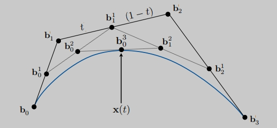
> 每次减一个点，重复的进行递归。

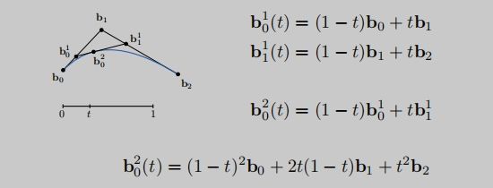
> b后面2这里不是平方，指的是第二层。

## 贝塞尔曲线-代数公式
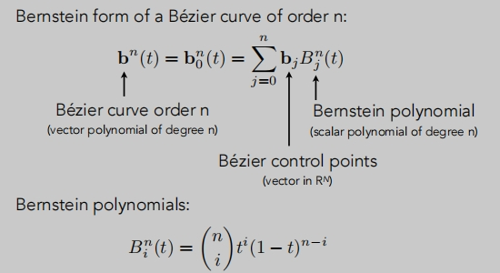
> 给定n+1个控制点，我们可以得到n阶的贝塞尔曲线。
>
> 这个贝塞尔曲线在任意时间 t 它都是之前给定的控制点的线性组合。
>
> 它组合的系数就是一个多项式，这个多项式是与时间有关的。
>
> 贝塞尔曲线的任意时间点就是控制点的组合，怎么组合？----用伯恩斯坦多项式进行组合。

> 坐标可以是三维坐标。

## 伯恩斯坦多项式

## 贝塞尔曲线特性
- 贝塞尔曲线必须过起点（t=0）和终点（t=1）。
- 三次贝塞尔曲线系数3 ？
- 仿射变换下：贝塞尔曲线依然一致。（对投影不行）
- 凸包性质

## 凸包
能够`包围一系列给定的几何形体`的`最小`的`凸多边形`。

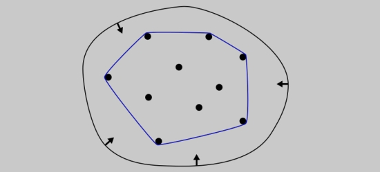

## 逐段贝塞尔曲线
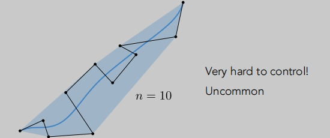
> 虽然可以绘制出平滑的曲线，但是无法表现控制。

逐段三次贝塞尔是最常见的技术：**每四个控制点定义一条贝塞尔曲线**。

> 这里其实有个小问题：连续性问题。

**连续性**

C0连续

> 第一段的终点等于第二段的起点（几何上最简单的连续）。

C1连续
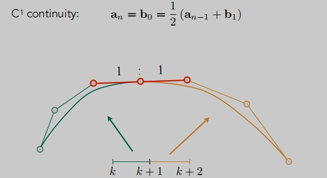
> 切线也要连续，向临两个控制必须共线，距离相等。一阶导数的连续。
>
> 还有要求更高的导数连续...

## B-splines（b样条曲线）
它是对贝塞尔曲线的拓展。

- 局部性，更可控。（非常复杂）

