# 几何的面

## 曲面

> 在u 和 v 上（或者说t1,t2）都有对应一个时间 t的贝塞尔曲线。

## 网格操作

- 网格细分
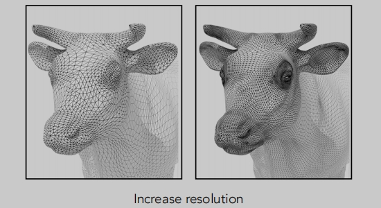

- 网格简化
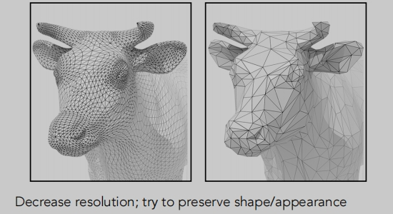

- 网格正则化（正则化）
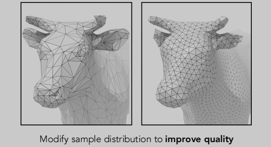
> 三角面处理成为更近似于正三角形。

## 三角面细分
1. 引入更多的三角形（增加数量）。
2. 让这些三角形的位置发生一些变化，使得原来的物体变化更平滑。（调整位置）

这里讲的是`Loop细分`（Loop是一个地面，算法作者所在的地方）

## Loop 细分

> 如何增加三角面？连接三角形三条边上的一个点（根据算法获得），从而获得4个小的三角形。
>
>如何调整三角形的位置（调整三角形顶点位置）？根据不同算法配新/旧顶点位置。

**新顶点位置调整**：
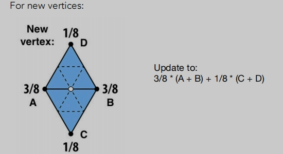
> 两个相邻共边的三角形ABCD。
>
> 根据ABCD四个顶点的位置，利用一种加权平均获得新顶点的位置：3/8 * (A + B) + 1/8 * (C + D)。

**旧顶点位置调整**:
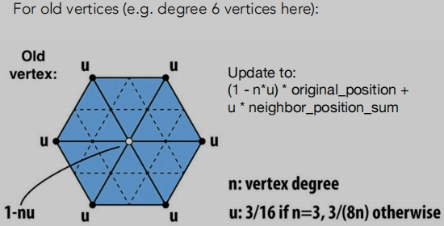
> 定义一个n，为白点（原点）的所对应的度。
>
> 定义一个u，是与n的度对应的一个系数。
>
> 根据（1-n * u） * 当前原点位置 + u * 周围加权平均顶点的位置。
>
> 这个算法，周围点越多当前点的权重越低，周围点越少，当前点权重越高。

Loop细分示例：
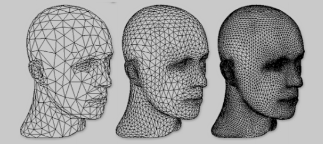

## 卡特莫尔-克拉克细分（一般网格）
对于三角形网格我们使用Loop细分，对于一般网格（既有三角形也有四边形）我们可以使用卡特莫尔-克拉克细分。

> 定义四边形、非四边形。
>
> 定义奇异点：`度`不为4的点（degree != 4）。

定义完之后如何进行细分呢（增加网格）？

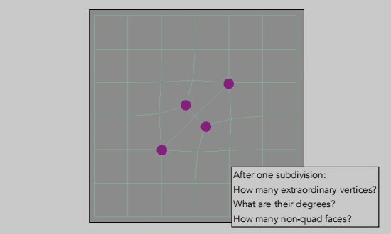
> 在每个面上添加顶点（面的中点/重心）。
>
> 在每个边上添加中点。
>
> 连接面和边的中点。
>
> 这样我们就增加了网格。

> 做完第一次`卡特莫尔-克拉克细分`

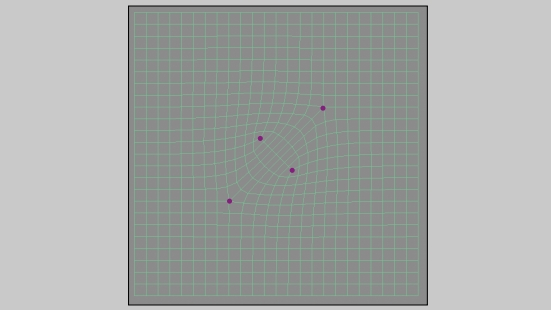
> 做完第二一次`卡特莫尔-克拉克细分`

**卡特莫尔-克拉克细分的性质**：
- 每一个非四边形面都会引入一个奇异点，并且在引入奇异点之后非四边形面都会消失。
> 简单来说，在一次`卡特莫尔-克拉克细分`之后，非四边形面会变成奇异点。
- 在做完第一次`卡特莫尔-克拉克细分`之后，会增加非四边形面数的奇异点个数，之后再做细分奇异点个数不再增加。

**卡特莫尔-克拉克细分顶点位置调整**

计算公式-分为三种类型的点：
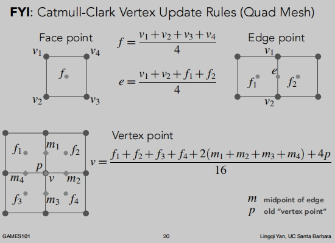
> f 面中心点
> 
> e 共边的中点
>
> v 旧的顶点位置

卡特莫尔-克拉克细分示例：
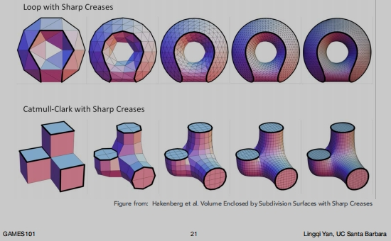

## 网格简化

**边坍缩**
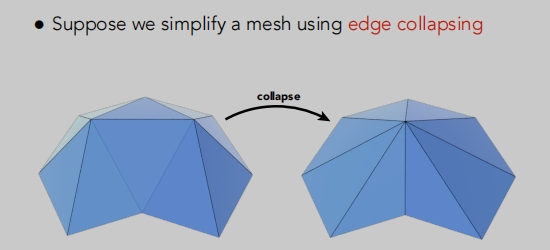
> 假设我们使用边的折叠来简化一个网格。
>
> 边坍缩实现起来并不容易。这里我们使用`二次误差度量`（二次是平方的意思）实现。

## 二次误差度量
新顶点应最小化其与先前相关的三角形平面的平方距离之和。
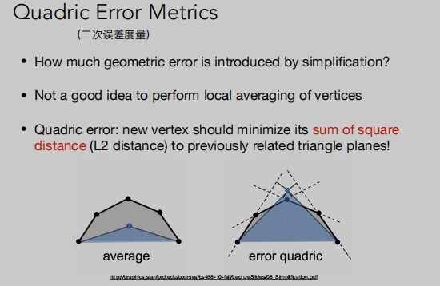
> 找一个点，使得到达和它相关的面距离的平方和最小。

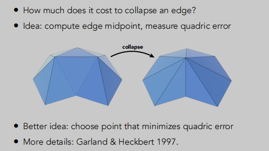
> 这是一个繁琐复杂的过程，需要解决很多问题。

网格简化深入学习[传送门](http://graphics.stanford.edu/courses/cs468-10-fall/LectureSlides/08_Simplification.pdf)

网格简化示例
