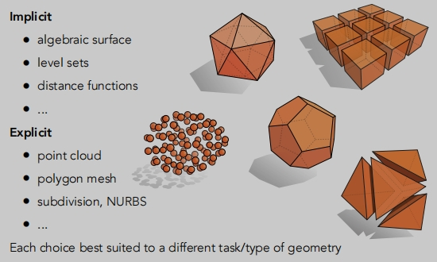
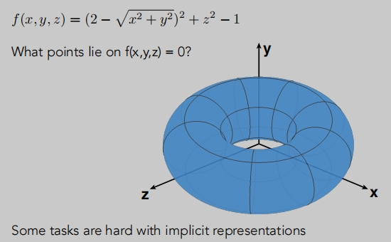
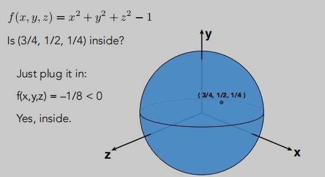
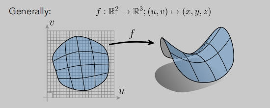
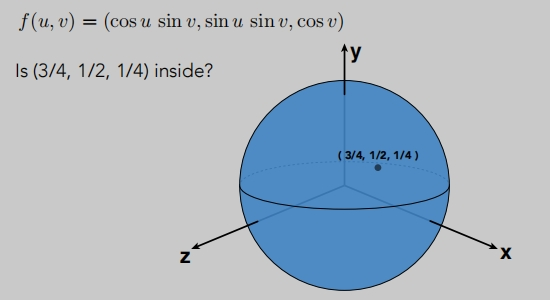
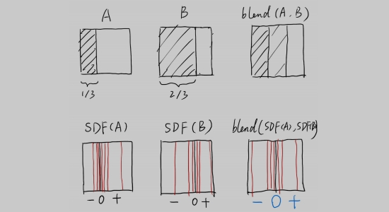
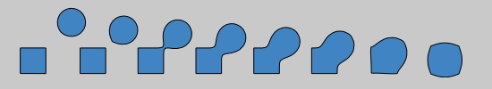
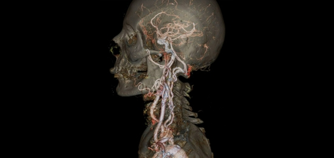
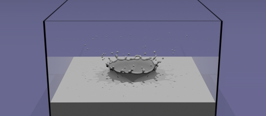

# 几何

**什么是隐式几何**：
- 代数曲面
- 水平集
- 距离函数

**什么是显示几何**：
- 点云
- 多边形网格
- ...

## 隐式几何
点满足某些特定的关系

三维图形中的所有点，其中x2+y2+z2 = 1，满足 f(x，y，z)= 0

> 红色表示1
>
> 蓝色表示-1
>
> f=0，我们如果找到所有的f=0的点，它就可以形成一个几何图形，这就是隐式的几何。

**隐式几何的表达方式**

坏处：

> 在f（x，y，z）= 0 时，它是什么？其实它是一个圆环。
>
> 隐式的几何，它是`不直观、很难直接描述几何图形`。

好处：

> (3/4, 1/2, 1/4) 这点在不在几何内？ 
> 
> 隐式几何可以`很容易判断出他们的几何关系`。

**显示几何表示方式方法**
- 一种是直接用几何图形表示。
- 还有一种是通过使用`函数参数映射`方式。
> 只要把每一个点找一边就能获得几何图形。

> 通过u v 参数映射

> 通过u v 参数映射，几何关系没那么容易判断。

没有哪种表示是绝对的好和坏。根据具体情况使用合适的方式。

## CSG表示几何（几何隐式表示）
通过布尔运算组合隐式几何图形。（有非常广泛的应用）
- 通过基本几何的基本运算，来定义新的几何。

## 距离函数表示几何（隐式）

> 距离函数：给出从任何地方到对象的最小距离（可以是有符号(正负)的距离）

例如：混合（线性交错线）一个可移动的边界

> S 表示正负
>
> DF 表示距离函数
>
> 可以记录几何边界。

纯距离函数表示的场景

## 水平集表示几何（隐式）
水平集和距离函数其实是一样的，只是表现行式不一样。

> 距离函数等于0的位置，它表示的就是物体的表面。
>
> 表面的插值等于零提供了更明确的控制形状（如纹理）
>
> 水平集在地理的`等高线`上有广泛应用。  

水平集也可以是定义在三维上的格子，这就与前面的纹理联系上了。

> 假设我们有一个三维的纹理，表示的是人体各个部位的密度。
>
> 如何从这个三维的信息提取出物体的表面呢？
>
> 我们可以密度函数等于某个值，然后找到所有满足这个值的位置，这样我们就可以获得这个表面，然后也可以和纹理结合在一起。

水滴效果

> 也可以通过距离函数(水平集)获得水滴与水面融合后的表面。

## 分形表示几何（隐式）
自相似的意思（类似于计算中递归）

> 分形在计算图形学中，在渲染的时候会引起强烈的走样，这在渲染中是一个非常大的挑战。

## 隐式表示的利与弊

优点：
- 隐式函数通常表述起来都很容易(一个公式就可以描述一个形状，这对于存储是非常有利的)。
- 某些查询很容易（内部对象，到曲面的距离），便于处理几个关系。
- 适合射线与表面相交（光线于物体表面）
- 对于简单的形状，精确的描述/无采样误差。
- 易于处理拓扑结构中的变化（例如，流体）。

缺点: 
- 很难模拟复杂的形状。