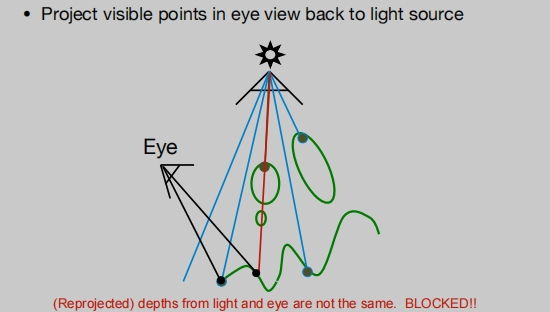
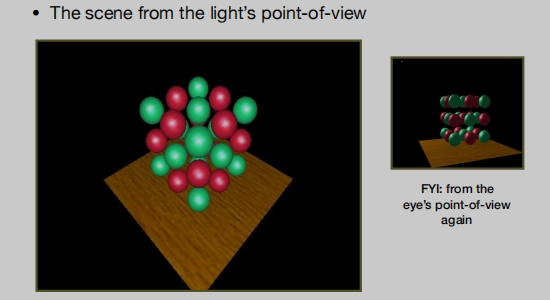
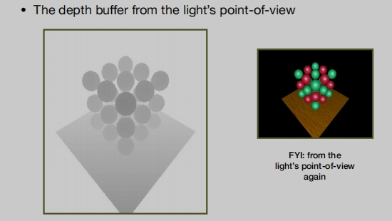
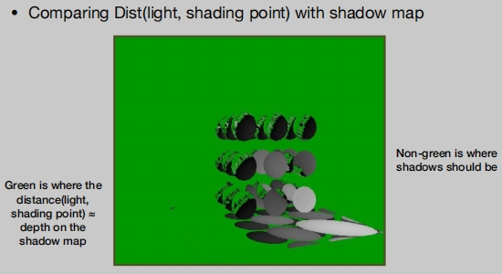

# 光栅化阴影

如何使用栅格化来绘制阴影？

## 阴影映射（Shadow mapping）

着色是一种局部的现象，着色的时候只考虑，光源、着色点自己（物体本身）、摄像机。这其实是不正确的，因为会存在其他物体遮挡在着色点和光源之间，这个时候着色是无法解决阴影的存在，Shadow mapping就是用来解决这一问题，并且限制在光栅化中。

**Shadow mapping 是一种图像空间算法**
- 在阴影计算过程中，不需要知道场景的几何形状。
- 同样也存在走样现象。
- 经典的`Shadow mapping`只能处理`点光源`。

**Shadow mapping 的核心思想**：

如果有一个点，它不在阴影里，你又能看到这个点，说明：摄像机能看到这个点，光源也能看到这个点（硬阴影）。

**点光源下如何生成阴影**？

第一步：

> 从光源看向场景/物体，记录当前得到场景/物体对应的深度（Z-Buffer），光源深度缓冲图。

第二步：

> 从定义的相机看向场景。

> 橙色线条对应的点：投影回点光源深度缓冲图对应的像素位置深度距离。
>
> 然后计算橙色线条对应的点实际到点光源的深度距离。
> 
> 进行比对（结果是一致的，证明摄像机能看到这个点，光源也能看到这个点--可见的）。

> 红色线条对应的点：投影回点光源深度缓冲图对应的像素位置深度距离。
>
> 然后计算红色线条对应的点实际到点光源的深度距离。
>
> 进行比对（结果不一样--存在阴影）。

## Shadow mapping 应用示例

> 图左：从光线的角度来看，这个场景。
>
> 图右：从眼睛（像机）的角度来看。

> 记录从光的角度来看，深度缓冲图（Shadow map）。

> 绿色是阴影贴图上的距离（灯光、阴影点）≈ 深度。
>
> 非绿色是阴影应该出现的地方。（该区域投影回点光源的深度的实际距离 与 点光源深度缓冲图记录的深度距离 比对得出）

## Shadow mapping存在的一些问题

- 由于数值（浮点数）存在的精度问题（比对 深度缓冲图时）。
- Shadow map 自身分辨率。
- 只能做硬阴影。

Shadow mapping 虽然存在一些问题，但任然是工业界的主流技术。

## 硬阴影与软阴影

