# 光线追踪

## 光栅化存在的问题
使用光栅化的存在的一些缺陷：不能好的表示全局的效果。
- 无法很好的做`软阴影`（后面改进才可以的，耗性能）。
- 无法很好的做`光泽反射`。
- 无法很好的做`间接光照`（多次反射）。

## 光线追踪存在的问题
- 光线追踪是准确的、质量高的，效果非常好，但非常慢，非常耗性能。
> 光线追踪更多的应用是`离线应用`。
>
> ~10K CPU核心小时，在生产中渲染一帧。

## 光线是什么？
- 光以直线传播（尽管这是错误的，它是一种波，这说它是直线也没什么问题）。
- 如果光线交叉，它们就不会相互“碰撞”（尽管这仍然是错误的）。
- 光线从光源传播到眼睛。（经过各种曲折的弹射过程，但是物理学在路径反转下是不变的----拥有可逆性）。

## 如何做光线追踪？
**利用的就是光线路径的可逆性**。
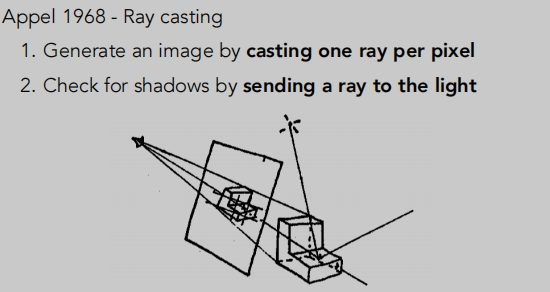
首先是要做光线的投射：
> 假设我们往一个虚拟的世界看，有一个成像的平面，被分割为很多的像素格子。
>
> 从相机出发，到达某一个像素点，连一条线。
>
> 然后把这个点与光源进行连线，这里是为了判断这个点是不是对于光源也可见，如果不在阴影里，那么我们就获得一条有效的光路（光源 --> 物体 --> 相机）。
>
> 有了光路我就可以计算这条光路的能量，从而计算像素点的颜色，再进行着色。

在做光线追踪时存在一些假设：
1. 眼睛永远为一个针孔摄像机。（是一个点，暂时不考虑实际相机怎么处理）
2. 光源也假设是个点光源。
3. 对于物体遇到光线后，也假设会发生完美的折射或反射。

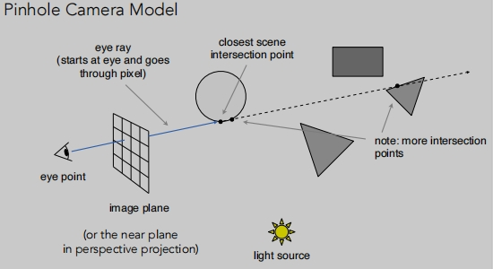
> 眼睛发出一条直线，相交于最近的点。

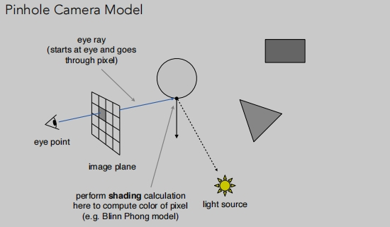
> 连线眼睛（相机） --> 物体 --> 光源，知道入射方向、折射方向、法线等信息，我们就计算像素点的颜色进行着色（例如Blinn Phong模型）

上面描述的其实还是光线只弹射一次，下面开始 递归式（抖动式）光线追踪。

## 递归式光线追踪(Whitted-Style)
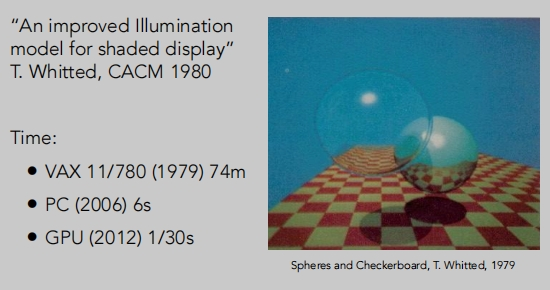
上图不同年代花费的渲染时间：
> 1979 -- 74m
>
> 2006 -- 6s
>
> 2012 -- 1/30s

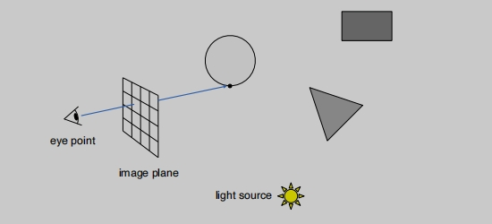

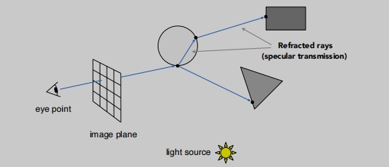
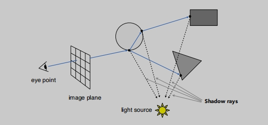

> 折射和反射的时候都会发生能量的损失。
>
> Whitted风格的像素颜色计算 会把一个点的多个计算结果加起来。

## 定义光线
光线是由它的原点和一个方向向量来定义的。

> 从o 开始 往 d 方向 经过 t 时间。**r**(t) =  **o** + t **d**
>
> 这里相当于定义一条射线。

## 光线与球体的交点

> 光线：r(t) = o + t d, 0 <= t < ∞
>
> 球体：p : (p − c)2 − R2 = 0；这里是隐式定义：求上的任意点p到圆心的距离c = 半径R
>
> 如何表示他们的交点呢？这个交点应该是既在射线上也在球的表面上：(o + t d − c)2 − R2 = 0

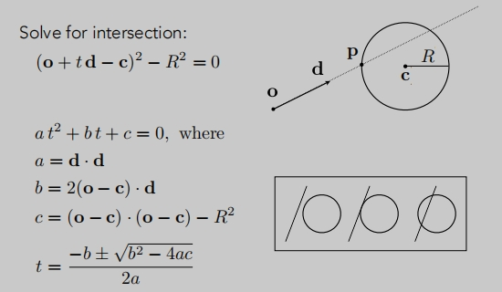
> 计算 t 

## 光线与一般性的隐式表面交点（推广）

## 光线与显示表面求交点
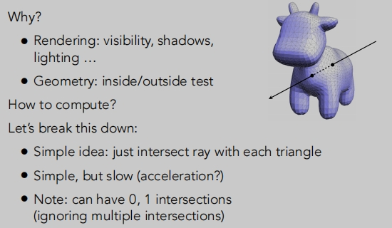
> 一个简单的想法：只需把光线与每个三角形相交。简单，但缓慢（如何加速？---后面讲的`包围盒`）
>
> 可以有0或1个交叉点。

如何做三角形与光线求交？
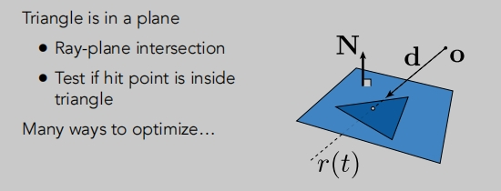
> 三角形与光线求交点其实就是：光线与一个平面求交点。
>
> 我们需要先定义一个平面。

## 定义平面
平面可以由法向量和平面上的一个点来定义。
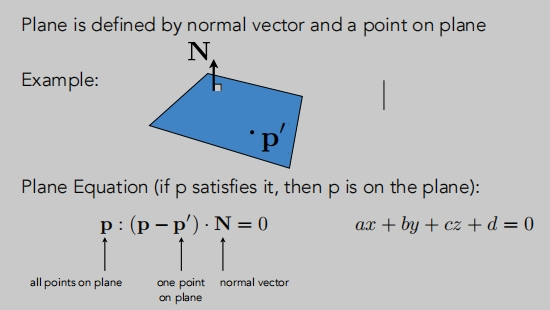
> 定义一个平面的法线向量（这里只能知道这个平面的朝向，它可以向着朝向移动，无法知道是哪一个平面）
>
> 还行需要定义个一点。（这个平面必须经过某一个点）
>
> 这样就能由`法向量`和`平面任意一个点`定义出一个平面。

## 光线与平面的交点
同样的思想：交点既在平面上，也在光线上。
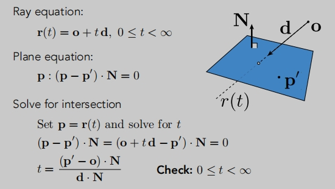
 
**Möller-Trumbore算法**
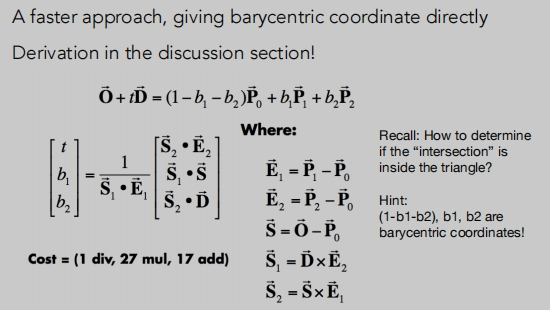

## 包围盒加速（AABB轴对齐包围盒）
如果光线不能与它的包围盒相交，则肯定无法与物体本身相交。

**AABB轴对齐包围盒**

**如何判断光线与包围相交**

- 只有当光线进入所有的对面，光线才会进入盒子。
- 只要光线离开任何一对面，光线就会离开盒子。
- 对于每一对面，各计算一次tmin和tmax（负数是可以的）。
- 计算出tmin和tmax，进入的时间求最大值，离开的时间求最小值。

**tmin、tmax正负号情况**：
应该检查t是否是负的物理正确性：因为光线并不是一条线，而是射线。
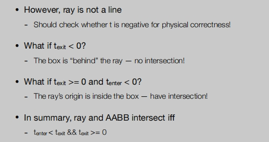
> `离开的时间` < 0 ， 这个盒子就在射线的“后面”，不存在交点
>
> `进入的时间` < 0 ，`离开的时间` > 0 ，光线的原点在盒子里，有交叉点！
> 
> `进入的时间` < `离开的时间` `&&` `进入的时间` >= 0 ，说明 光线在盒子里有段时间，有交叉点。

**为什么使用包围盒**？
