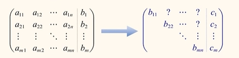

# 线性方程组

## 线性方程组求解：消元

:::tip 注意
初等行变换是同阶变换，初等列变换并不是同阶变换。
:::

## 线性方程组求解：最简型方程
先了解两个简单概念：

:::info **`行阶梯型矩阵`**（自上而下）
①、若有零行，零行都在最下方

②、非零行的第一个不为0的元素(称为主元)，并且下一行的主元的列标必然增加(若存在)

:::

:::info **`行最简型矩阵`**（自下而上）
①、是阶梯型矩阵

②、每个非零行的主元全部是 1

③、每个主元所在的列的其余元素全部是 0

:::

## 秩

`有效方程的个数` = `行阶梯/最简形矩阵非零的行数` = `主元的个数` <lines text="被称为秩，用 r 表示"/> 。

## 解方程组流程

##  线性方程组求解：求逆解方程组

##  线性方程组求解：克拉默法则解方程组

## 判定方程解的情况
