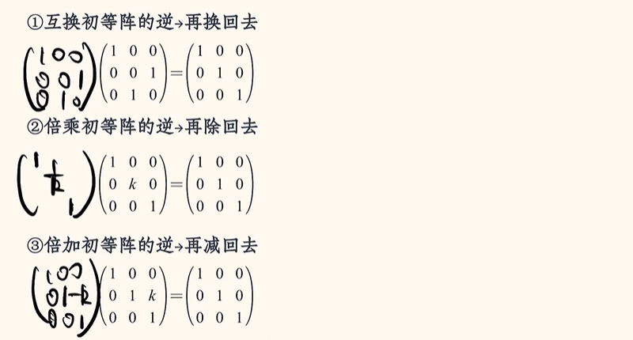
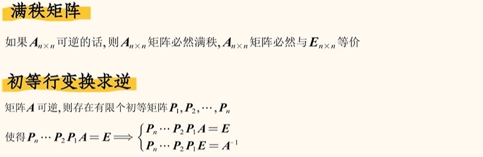
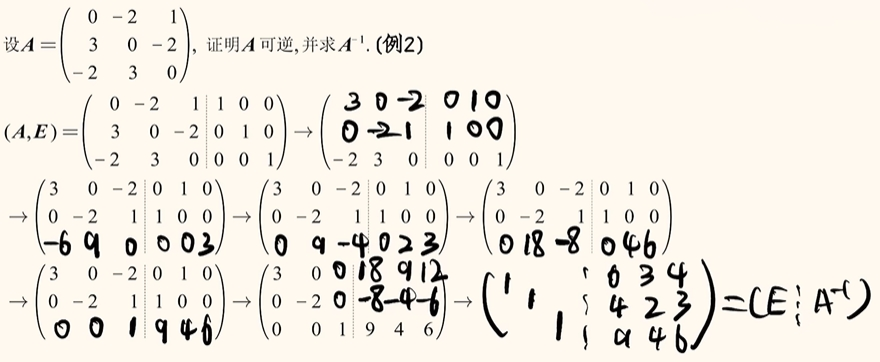

# 初等变换

## 初等行变换
三个针对`行`的操作：

①、互换变换: 交换两行

②、倍乘变换: 某一行乘上一个常数k(k≠0)

③、倍加变换: 把某一行的k倍加到另一行上去

## 初等列变换
三个针对`列`的操作：

①、互换变换: 交换两列

②、倍乘变换: 某一列乘上一个常数k(k≠0)

③、倍加变换: 把某一列的k倍加到另一列上去

## 初等矩阵

## 左行右列规则

左行: A左乘一个初等矩阵 --> A进行了一次相应的初等行变换

右列: A右乘一个初等矩阵 --> A进行了一次相应的初等列变换

## 初等矩阵与乘法
利用左行右列：

## 初等矩阵与逆

试题1（初等变换求逆）：

:::details 解析

:::

试题2（初等变换求逆）：

:::details 解析
解题思路：

:::
