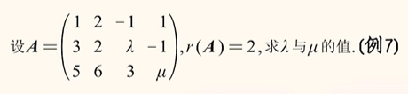
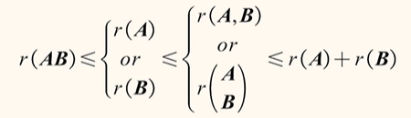

# 秩

反应：矩阵本质的不变量。

- 行阶梯形矩阵的非零行行数。
- 有效方程个数。
- 非零子式的最高阶数（用得少）。
- 独立向量个数。

试题1（初等变换求秩）：

试题2（初等变换求秩）：

:::details 解析

:::

## 公式总结
1. 转置不改变秩；
$$ r(A)=r(A^{T})=r(AA^{T}) =r(A^{T}A) $$  
2. 秩不大于行数/列数；
$$ 0 \leq r(A_{m * n}) \leq min \{ m,n \} $$  
3. 可逆变换不改变秩；
> 若A~B,则r(A)=r(B)
>
> 若P,Q可逆,则r(PAQ)=r(A)

4. 秩越乘越小,越拼越大,分开加最大；

5. 矩阵相乘等于零则：
$$ A_{m * n}B_{n * l} 则 r(A) + r(B) \leq n $$  