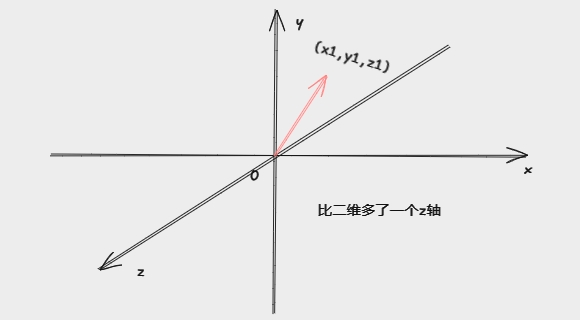
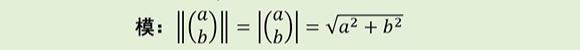

# 向量

## 概念
既有大小、又有方向的量称为`向量`，比如力、速度、加速度、位移等，可以用`有向线段`来表示向量。

## 向量的表示

$$\overrightarrow{AB} 强调向量的起点、终点$$

$$\vec{u} 、\vec{v} 不突出向量的起点、终点$$

## 相等向量

当`长度相同`、`方向一致`，这两个向量就相等，否则不等。

## 向量的定义（线性代数）
n个有序的数a1,a2,……,an所组成的数组称为n维向量，这n个数称为该向量的n个分量，第i个数ai称为第i个分量。n维向量可写成一列，也可写成一行，分别称为`列向量`和`行向量`: 

- 列向量
$$
  \begin{pmatrix}
  a_1 \\
  a_2 \\
  ... \\
  a_n 
  \end{pmatrix}
$$

- 行向量
$$
  \begin{pmatrix}
  a_1 &
  a_2 &
  ... &
  a_n 
  \end{pmatrix}
$$

n 也称为该向量的 `维数`。

## 二维向量

## 三维向量

## N 维向量
在空间维度上可能不怎么好描述，但可以把他理解成为，游戏中的角色拥有的各个属性：攻击、法力、暴击、爆伤、移速、射程等等，向量的最终中结果可以代表该角色的强度。

## 零向量
如果n维向量的所有分量都是0，则称之为零向量

## 单位向量

$$ \frac{1}{||v||} v $$

## 相等向量
如果两个向量的`维数相同`，且`各个分量相等`，那么这两个向量相等。

## 向量的长度、方向

:::tip
向量只由它的方向和长度来决定，并不由位置来决定

:::

