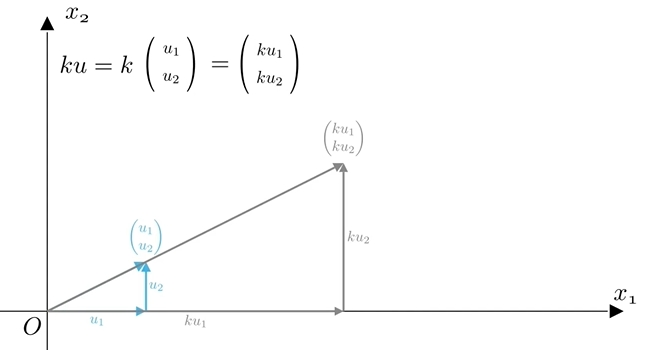
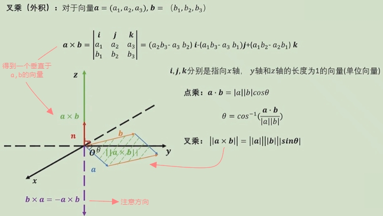

# 向量的运算

## 向量的加法

> 向量的加法：由向量v的终点处，做另一个向量w的起点，两个向量和就等于向量v的起点指向向量w的终点（主对角线）。

> 向量的减法：由向量v的终点处，做另一个向量-w的起点，两个向量和就等于向量v的起点指向向量-w的终点（副对角线，注意方向：向量的方向是`减号后面向量的终点`指向`减号前面向量的终点`）。

## 向量的数乘

> 将各个分量，放大了k 倍。

> 它的几何含义：`k < 0 `时，反方向的伸缩，`k > 0 `时，同方向的伸缩

伸缩后的向量k与原向量u平行，因此可以借助数乘来定义平行:
> 若u和v满足u =kv,k∈R，则称u平行于v，记作u // v。
>
> 因为零向量0和任意向量u始终有0=0u，所以零向量与任意向量平行，也可以说零向量的方向任意。

:::tip 
向量的加法和数乘，称为向量基本运算。运算后的结果仍然是向量，并且`维度`也没有发生改变。
:::

## 向量的点乘（内积）

## 向量的叉乘（外积）
