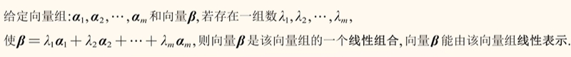
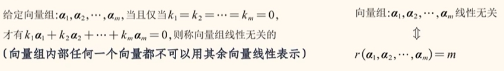
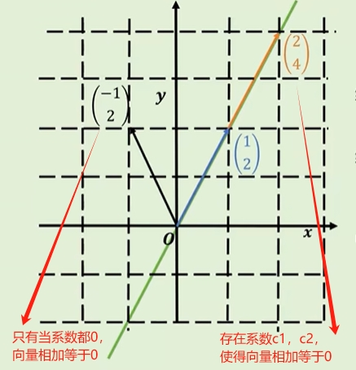
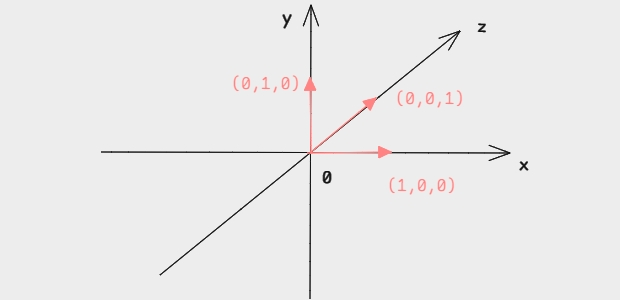
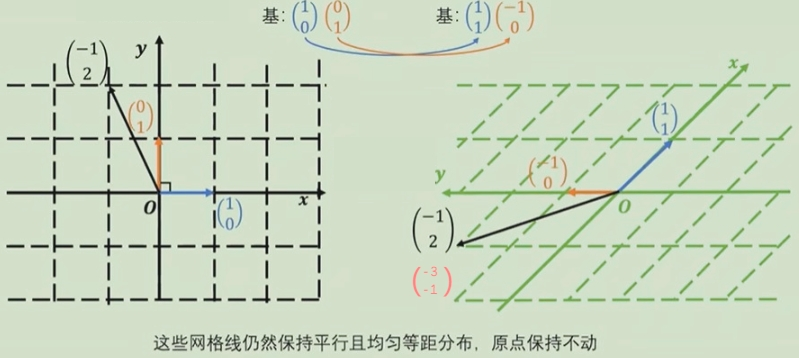
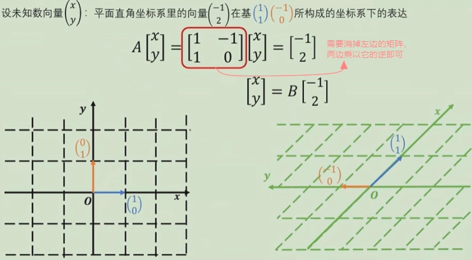

# 向量的线性组合与线性相关

## 向量组

若干`同维数`的向量a1,a2,……,an所组成的集合A，被称为`向量组`，记作:

>  A: a1,a2,……,an   或 A = {  a1,a2,……,an } 

## 线性组合与线性表示

**线性组合**：
$$ 
  \begin{matrix}
  {c_1,c_2,...,c_k}为常数 ， {v_1,v_2,...,v_k} 为R^n中的向量 \\
  c_1v_1+c_2v_2+c_kv_k为向量{v_1,v_2,...,v_k}的线性组合。
  \end{matrix}
$$

**线性表示**：意思就是用线性组合来表示；

## 张成空间
向量的`全部线性组合`所构成的`向量集合`就是它`张成空间`。

> 这个平面就它的张成空间

:::info 问题
为什么，有的向量的张成空间是一个平面，而有的张成空间是一条线？是因为的有向量是`线性相关`，有的向量是`线性无关`。
:::

## 线性相关与线性无关
**线性相关**：

存在不全为零的系数时线性组合也为零（可通过系数拉伸向量可以使其相等）。

$$
  1
  \begin{pmatrix}
  2\\
  4
  \end{pmatrix}
  - 2
  \begin{pmatrix}
  1 \\
  2
  \end{pmatrix}
  = 
  \begin{pmatrix}
  0 \\
  0
  \end{pmatrix}
$$

**线性无关**：

n个向量组成的向量组的线性组合只在系数为零时为零（怎么拉伸都不可能相等）。
$$
  0
  \begin{pmatrix}
  -1\\
  2
  \end{pmatrix}
  + 0
  \begin{pmatrix}
  1 \\
  2
  \end{pmatrix}
  = 
  \begin{pmatrix}
  0 \\
  0
  \end{pmatrix}
$$
:::tip 几何上的线性相关与线性无关
线性相关：这组向量里有多余的向量，把它去掉以后也不影响原有的张成空间。

线性无关：没有多余的向量，去掉任何一个都会影响原有的张成空间，每一个向量都代表了一个新的维度。
:::

## 秩
该向量组可以张成的空间的维度，用r来表示；
> 向量组里有多少个线性无关的向量，那么这个向量组的秩就是多少

## 基
n个线性无关的向量可以通过线性组合张成一个n维空间---> 这n个线性无关的向量 就是这个n维空间的 `基`。

**标准的正交基**
两两垂直，长度为1的基。

$$
\widehat{i} :x轴方向的标准正交基
$$
$$
\widehat{j} :y轴方向的标准正交基
$$

$$
\widehat{k} :z轴方向的标准正交基
$$

## 向量的线性变换
换基（线性变换）

线性变换过程：

这里可以把`矩阵`理解成线性`变换`，`逆矩阵`理解成`还原`。

