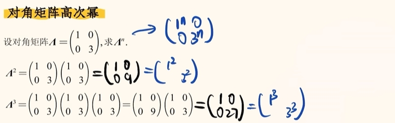
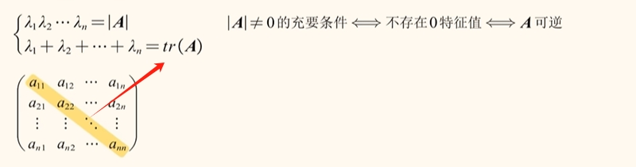
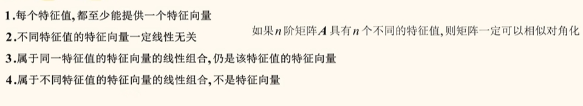

# 特征值与特征向量

## 对角矩阵的高次幂

对角矩阵的高次幂是非常好求的

问题：当我们遇到的不是对角矩阵时，要求高次幂怎么办呢？就引出了`相似对角化`，把普通的矩阵求高次幂转嫁为对角矩阵求高次幂。

## 相似对角化

$$
\begin{aligned}
P^{-1}AP = \Lambda \\
\Lambda 就是A矩阵特征值组成的对角矩阵 \\
P 就是A矩阵特征向量组成的矩阵

\end{aligned}
$$

## 特征值与特征向量
$$
\begin{aligned}
\color{#f66} A	\chi = \lambda \chi (\chi 	\not= 0) \\
这里 \lambda 就是矩阵A的特征值 \\
这里 \chi 就是矩阵A的特征向量
\end{aligned}
$$

特征值与特征向量求值过程

例题：

## 特征值的性质

## 特征向量的性质

## 特征值与特征向量的推论

## 相似对角化的充要条件及性质

## 相似对角化的根本起源
