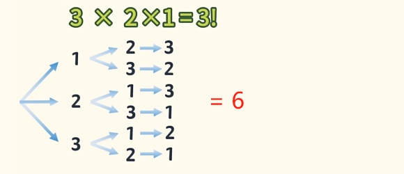
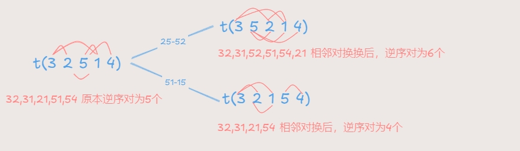

# 全排列

## 3 元排列

`3元排列`(有1.2.3三个数,不重不漏,按一定顺序排成一行,即是“一个"3元排列)

有多少种排列方式呢？

3元排总共 有 `3!` 种排列方式。

## N 元排列

n元排列(有1.2..n.共n个数,不重不漏,按一定顺序排成一行,即是"一个"n元排列)

n元排总共 有 `n*(n-1)...*1` = `n!` 种排列方式。

## 逆序数

若存在一个大数排在一个小数前面,则这一对数构成`“一个逆序”`，而逆序数,其实就是`"逆序的总个数"`。

逆序数不在乎个数、只在乎奇偶。

示例：
> t（12...n） = 0  
> 
> t（32514）= 5

## 奇偶排列
- 逆序数为`"奇"`称为`奇排列`；
  
- 逆序数为`"偶"`称为`偶排列`；

**兑换辆数，奇偶改变**。

**相邻兑换**

> 一组排列,若相邻两个数对换,则奇偶性发生改变。逆序数 `+1` 或 `-1`

**任意兑换**

> 一组排列，任意两个数对换（2k+1为基数次）,则奇偶性`必然`发生改变。

**试题**

