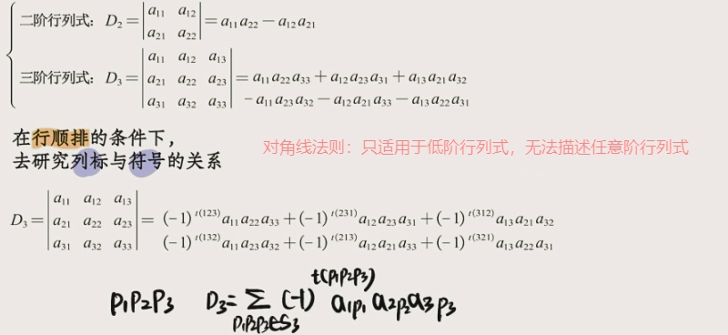
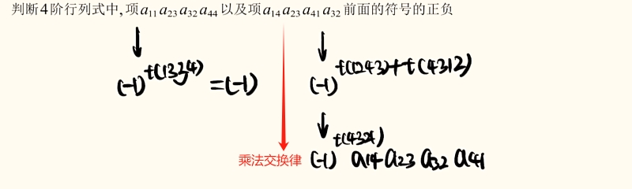
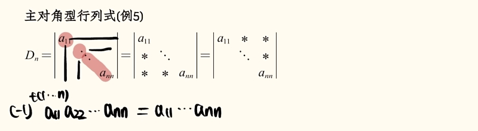
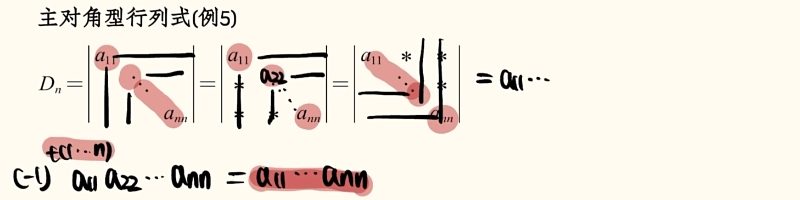
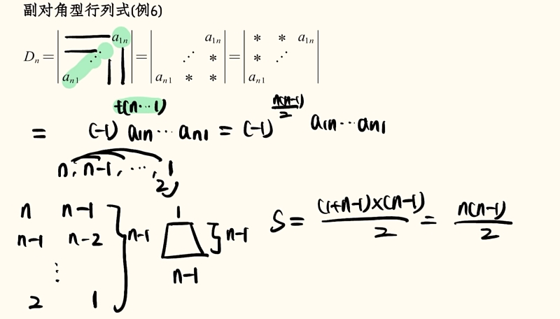

# 行列式的定义

## 二三阶行列式

## N 阶行列式的原始定义

## N 阶行列式按行定义

## N 阶行列式按列定义

列标都是顺序排列,而“行标取n元排列的所有可能”,其正负由行标排列的奇偶性决定。

:::info 
`按行定义` 和 `按列定义` 其实都是 `原始定义` 的特殊情况。

- 原始定义：行标逆序数+列标逆序数；
- 按行定义：行标逆序数（为0） + 列标逆序数；
- 按列定义：行标逆序数 +列标逆序数（为0）；
:::

## 试题一

## 试题二

## 试题三

## 试题四

## 试题五

## 试题六
