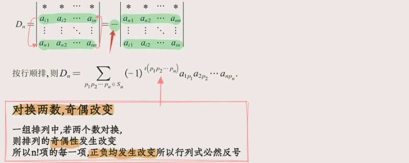
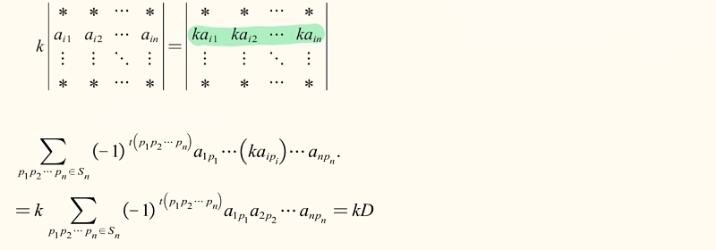
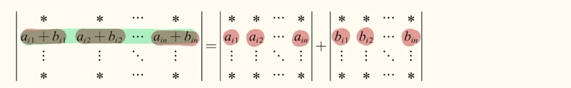
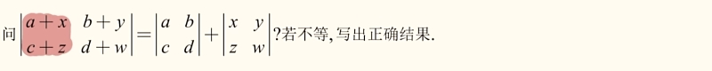
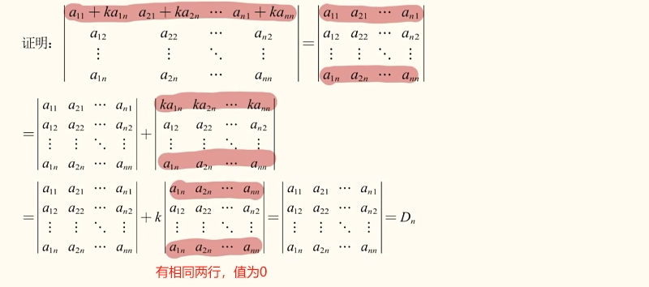
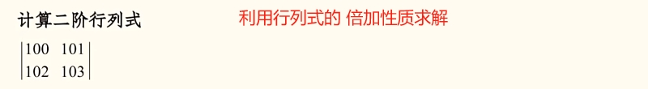
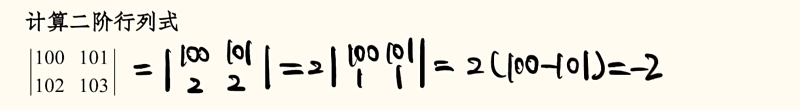

# 行列式的性质

## 性质一：行列式转置

- 行列式转置，值不变；

- D = D T，`行`变为`列`；

推论：在行列式中,行和列的地位相等，适用于`行`的也一定适用于`列`；

## 性质二：行列式的互换性质

- 行列式交换两行（或两列），其值取反号。

推论：若行列式在两行(列)相同,其值为0；

## 性质三：行列式的倍乘性质

- 行列式某行(列)乘k,等价于k乘原行列式；

推论一：若行列式某行(列)有公因子k,则k可以提出；

推论二：若行列式有两行(列)成比例,其值为0；

## 性质四：行列式的可拆性质

- 行列式某行(列)元素均为两个数之和，则行列式可以分解为两个行列式之和；

推论：单行(列)可拆性 一次只能拆一行(列)其它元素必须保持不变；

试题：

:::details 解析

:::

## 性质五：行列式的倍加性质
- 将行列式的某行(列)的k倍加到另一行(列)上则行列式的值不变；

推论：创造更多的“0”,为行列式展开定理做铺垫；

试题1：

:::details 解析

:::

试题2：

:::details 解析

:::

## 总结

