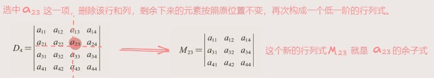
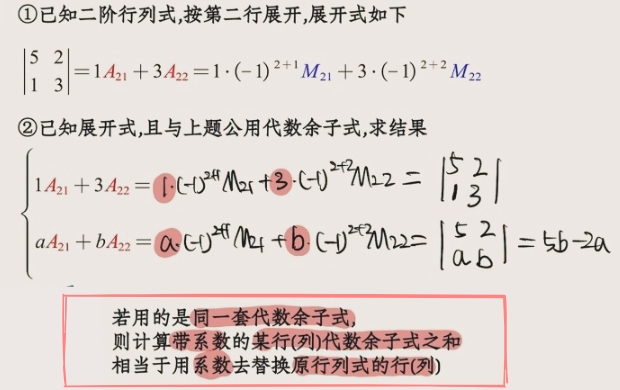
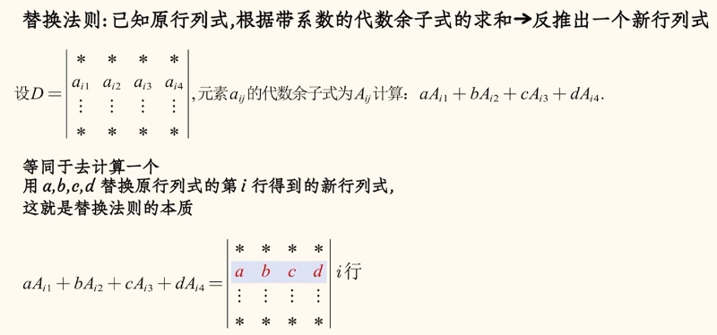
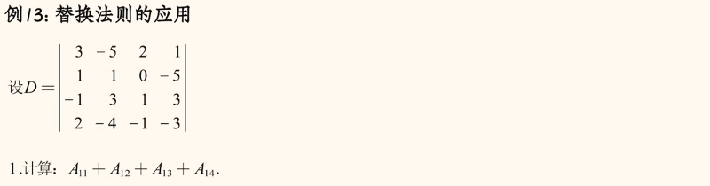
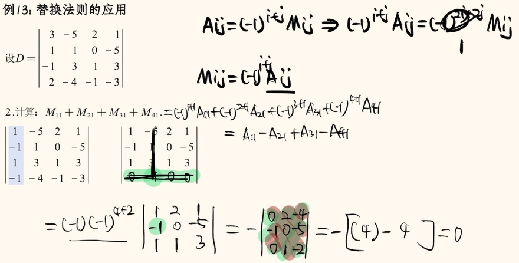
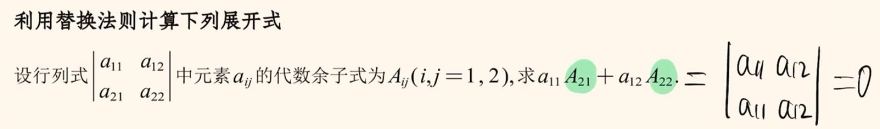
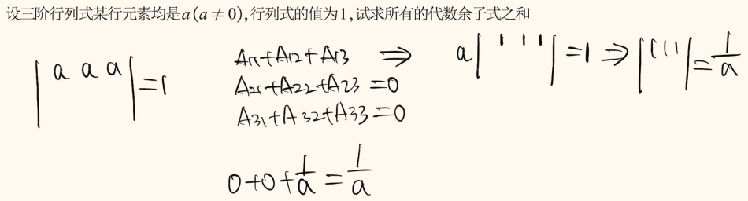

# 行列式的展开

## 为什么要展开？

降阶行列式，要引入两个新的念：`余子式`、`代数余子式`。

## 余子式

- Mij(余子式)：选中一个元素后,直接删掉其所在的行列，剩余下来的元素按照原位置不变，再次构成的(n-1)阶行列式。

## 代数余子式

`代数余子式` 就是`前面带着一个符号的余子式`，就叫代数余子式。
> 这个符号由被选中元素的“位置”决定。

:::details 示例

:::

## 行列式的展开定理
- 行列式 = 某一行(列)的“元素”与该行(列)的“代数余子式”对应相乘再相加。

试题1：

:::details 解析

:::

试题2：

:::details 解析

:::

## 拓展--替换法则
### 替换法则起源
:::info
起源一：

起源二：

:::

### 替换法则的基本原则
:::info 替换法则，代数余子式求和

:::

:::details 试题1：

解析：

---

解析：

:::

:::details 试题2：

:::

### 替换法则推论

:::details 试题1：

:::