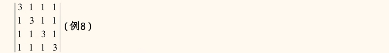
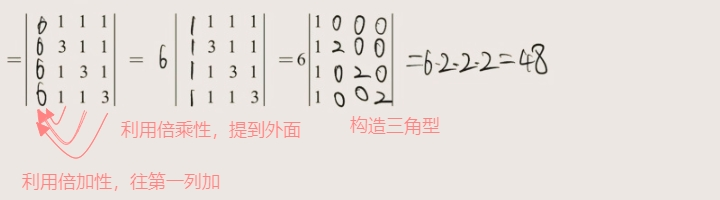
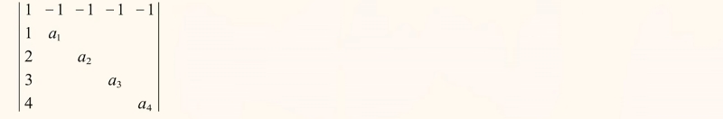
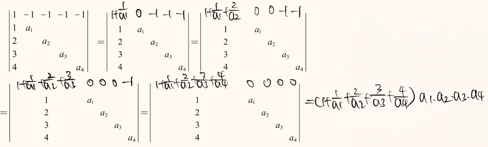
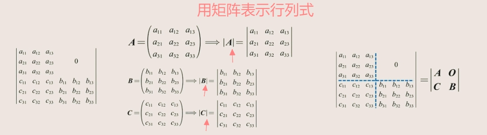
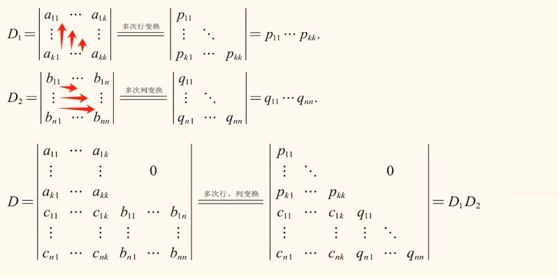
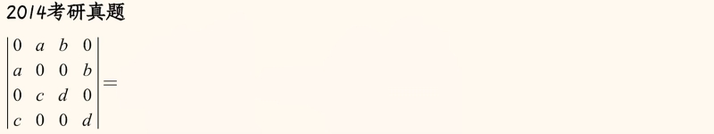
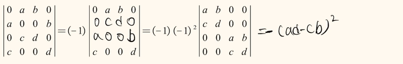
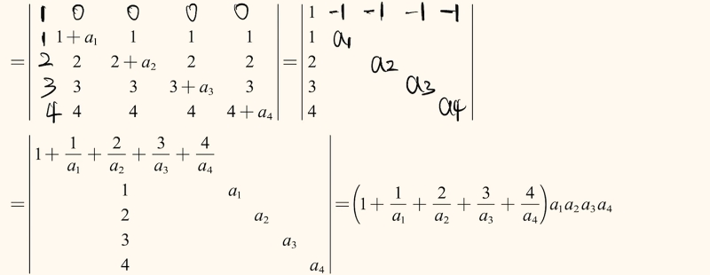
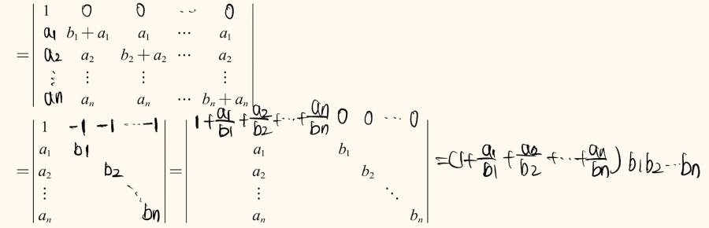

# 行列式题型

## 对角线法则
- 基础的

## 行列式定义
- 基础的

## 行列式性质相关的题型
1. 行（列）和相等型
2. 爪型行列式
3. 矩阵分块行列式

## 行列式展开
1. 加边法
2. 么型行列式
3. 川型行列式
4. 范德蒙德行列式

## 行（列）和相等型
- 每行（列）相加的数相同。

试题1:

:::details 解析

:::

试题1：

:::details 解析

:::

## 爪型行列式

试题1:

:::details 解析

:::

试题1：

:::details 解析

:::

## 矩阵分块行列式

用矩阵表示行列式：

化主对角行列式：

由上面可以得出 `拉普拉斯展开式`：

试题：

:::details 解析

:::

## 加边法

- 逆用行列式的展开性质。

试题：

:::details 解析

:::

试题：

:::details 解析

:::

## 么型行列式

## 川型行列式

## 范德蒙德行列式