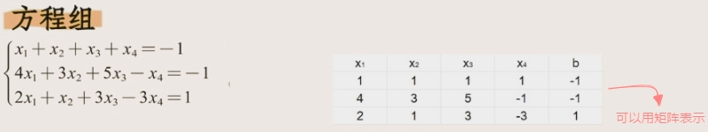
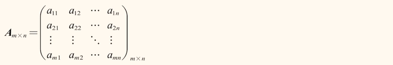
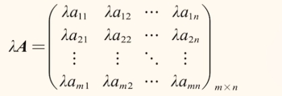
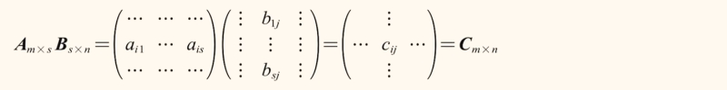
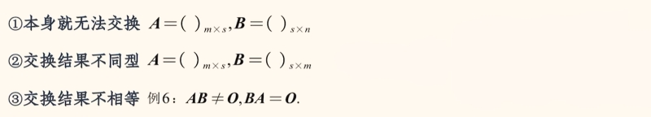
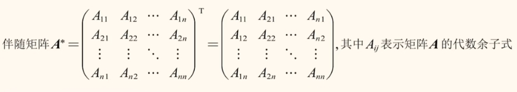
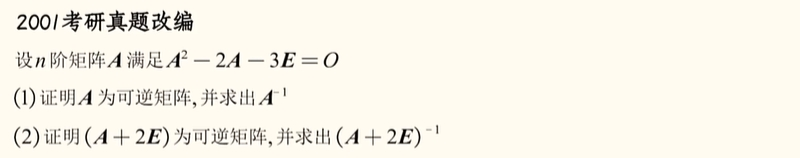
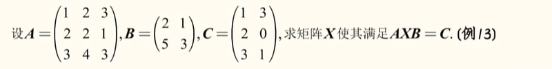

# 矩阵

## 什么是矩阵

**由m x n个数 组成的一个 m 行 n 列的`数表`,就是一个“矩阵”。用于存储数据信息。**

## 矩阵于行列式有什么关系？

- 矩阵本质是一个数表，行列式本质是一个数。（我的理解：一个是数据解构，一个是数）
- 解构上类似：
  > 矩阵的`行和列`可以是`任意`的；
  >
  > 行列式的`行和列`必须`相等`的；

  > 只有矩阵的为`方阵`（行和列相等）时，才具备一些行列式的特性。

## 同型矩阵

- 两个矩阵的行数、列数均相等。

## 相等矩阵

- 两个矩阵同型,并且元素均对应相等。

## 矩阵的运算

### 矩阵的加减运算
- 必须是同型矩阵才能相加减。

- 具有交换律：A+B=B+A
- 具有结合律：(A+B)+C=A+(B+C)

### 数与矩阵相乘

### 矩阵与矩阵相乘
- 左取 `i` 行,右取 `j` 列,对应相乘再相加,构成新矩阵处在`( i, j )`位置的元素。
  > 能否相乘提看内标，结果看外标。

### 矩阵与矩阵的乘法运算性质

- 不具备交换律

- 不具备消去律

- 具备结合律、左分配律、右分配律。

## 特殊矩阵

## 矩阵的转置
- 原来的矩阵`行`变成`列`。

- 矩阵转置的性质：

## 方正行列式

## 伴随矩阵

> 矩阵元素的代数余子式的转置；

**伴随矩阵的起源**：

## 逆矩阵

> 回顾一下`倒数`：在数的乘法中,若a≠0,则存在唯一的数b，使得ab=ba=1。
>  $$ a = {1 \over b} $$ 

- 在矩阵的乘法中,若|A|≠0, 则存在唯一的矩阵B。使得AB=BA=E。则A可逆,矩阵B是A的逆矩阵,即B=A-1

**逆矩阵的性质**

试题1：

:::details 解析

:::

试题2：

:::details 解析

:::

试题3：

:::details 解析

:::

试题4：

:::details 解析

:::

## 逆矩阵与伴随矩阵
**`推论：A A* = A* A = |A| E`** 
$$ A^{-1} = {A^* \over  |A| } $$   
$$ A^{*-1} = {A \over  |A| } $$   
$$ A^{*} = { |A|A^{-1} } $$

