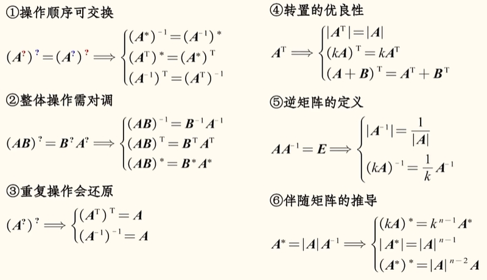
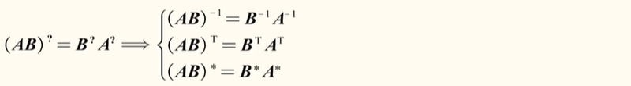
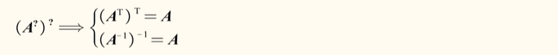
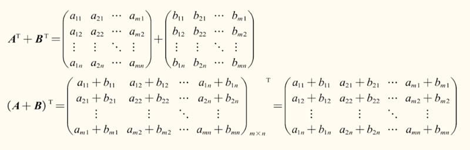

# 矩阵公式总结

## 操作顺序可交换
对矩阵的 `T` 、 `*` 、 `-1`  （转置、伴随、逆），的操作顺序都是可以交换的。

## 整体操作要对调
对整体的 `T` 、 `*` 、 `-1`  （转置、伴随、逆），的操作顺序都是可以交换的。

## 重复操作会还原
对矩阵的 `T` 、 `-1`  （转置、逆），的操作顺序都是可以交换的。

## 转置的优良性

$$ (A + B)^{-1} \neq A^{-1} + B^{-1} $$ 

$$ (A + B)^{*} \neq A^* + B^* $$ 

由此可以看出`转置的优良性`。

## 逆矩阵的定义
矩阵乘以逆等于单位矩阵。

## 伴随矩阵的推导

伴随等于行列式乘以逆。
