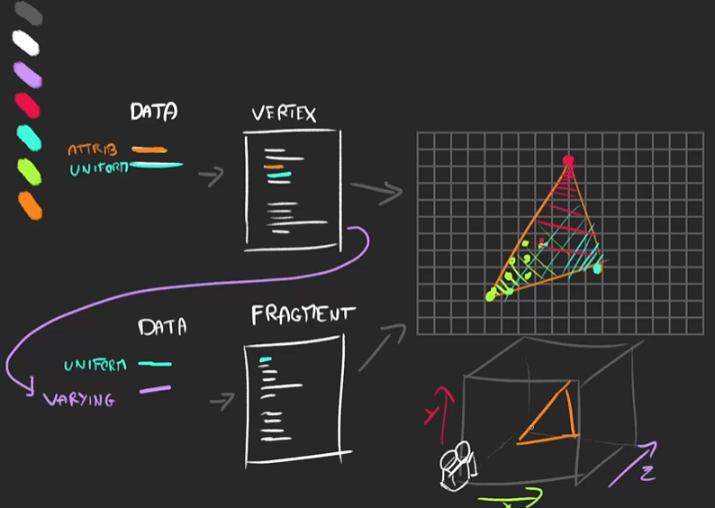

# ShaderMaterial

使用自定义shader渲染的材质。 shader是一个用GLSL编写的小程序 ，在GPU上运行。您可能需要使用自定义shader。

## 基本使用

代码示例
```javascript
import vertex from "./vertex.glsl";
import fragment from "./fragment.glsl"; // 
const material = new THREE.ShaderMaterial( {
	uniforms: {
		time: { value: 1.0 },
		resolution: { value: new THREE.Vector2() }
	},
	vertexShader: vertexShader, // 顶点着色器
	fragmentShader: fragmentShader // 片元着色器
} );
```
>  glsl文件 需要配合插件 vite-plugin-glsl 使用，在vite.configs文件中配置好，才能用import的方式导入。


:::tip 注意事项 :star: :star: :star:
1. ShaderMaterial 只有使用 WebGLRenderer 才可以绘制正常， 因为 vertexShader 和 fragmentShader 属性中GLSL代码必须使用WebGL来编译并运行在GPU中。
2. 从 THREE r72开始，不再支持在ShaderMaterial中直接分配属性。 必须使用 BufferGeometry实例，使用BufferAttribute实例来定义自定义属性。
3. 从 THREE r77开始，WebGLRenderTarget 或 WebGLCubeRenderTarget 实例不再被用作uniforms。 必须使用它们的texture 属性。
4. 内置`attributes`和`uniforms`与代码一起传递到shaders。 如果您不希望WebGLProgram向shader代码添加任何内容，则可以使用`RawShaderMaterial`而不是此类。
5. 您可以使用指令`#pragma unroll_loop_start`，`#pragma unroll_loop_end` 以便通过shader预处理器在GLSL中展开for循环。 该指令必须放在循环的正上方。循环格式必须与定义的标准相对应。
   - 循环必须标准化normalized。

   - 循环变量必须是i。
  ```
  #pragma unroll_loop_start
  for ( int i = 0; i < 10; i ++ ) {
    // do ...
  }
  #pragma unroll_loop_end
  ```
6. 
:::


## 顶点着色器和片元着色器



- 顶点着色器首先运行; 它接收attributes， 计算/操纵每个单独顶点的位置，并将其他数据（varyings）传递给片元着色器。:star: :star: :star::star: :star:

- 片元（或像素）着色器后运行; 它设置渲染到屏幕的每个单独的“片元”（像素）的颜色。:star::star::star::star::star:


## `uniforms`、 `attributes`、 和 `varyings`

shader中有三种类型的变量: `uniforms`、`attributes`、和 `varyings`：

- Uniforms 是所有顶点都具有相同的值的变量。 比如`灯光`，`雾`，和`阴影贴图`就是被储存在uniforms中的数据。
  > <lines text="uniforms 可以通过顶 点着色器 和 片元着色器 来访问"/>。
- Attributes 与每个顶点关联的变量。例如，`顶点`、`位置`、`法线`、`顶点颜色`都是存储在attributes中的数据。
  > <lines text="attributes 只可以在 顶点着色器 中访问"/>。
- Varyings 对于每一个片元，每一个varying的值将是相邻顶点值的平滑插值。
  > <lines text="是从 顶点着色器 传递到 片元着色器 的变量"/>。

:::tip 注意：
在shader 内部，uniforms和attributes就像常量；你只能使用JavaScript代码通过缓冲区来修改它们的值。
:::

## 内置 attributes 和 uniforms

WebGLRenderer默认情况下为shader提供了许多attributes和uniforms。这些变量定义在shader程序编译时被自动添加到片元着色器和顶点着色器代码的前面，你不需要自己声明它们。

> uniforms或attributes（例如，那些和照明，雾等相关的）要求属性设置在材质上， 以便 WebGLRenderer来拷贝合适的值到GPU中。 如果你想在自己的shader中使用这些功能，请确保设置这些标志。

> 如果你不希望WebGLProgram 向你的shader代码中添加任何东西， 你可以使用RawShaderMaterial 而不是这个类。

`顶点着色器`内置的uniforms、attributes属性（无条件判断）
```glsl es
// = object.matrixWorld
uniform mat4 modelMatrix;

// = camera.matrixWorldInverse * object.matrixWorld
uniform mat4 modelViewMatrix;

// = camera.projectionMatrix
uniform mat4 projectionMatrix;

// = camera.matrixWorldInverse
uniform mat4 viewMatrix;

// = inverse transpose of modelViewMatrix
uniform mat3 normalMatrix;

// = camera position in world space
uniform vec3 cameraPosition;


// default vertex attributes provided by BufferGeometry
attribute vec3 position;
attribute vec3 normal;
attribute vec2 uv;

// 可以通过以下方式计算顶点着色器中顶点的位置
gl_Position = projectionMatrix * modelViewMatrix * vec4( position, 1.0 );

// 或
gl_Position = projectionMatrix * viewMatrix * modelMatrix * vec4( position, 1.0 );
```
`顶点着色器`内置的uniforms、attributes属性（有条件判断）
```glsl es
#ifdef USE_TANGENT
	attribute vec4 tangent;
#endif
#if defined( USE_COLOR_ALPHA )
	// vertex color attribute with alpha
	attribute vec4 color;
#elif defined( USE_COLOR )
	// vertex color attribute
	attribute vec3 color;
#endif
```
```glsl es
#ifdef USE_MORPHTARGETS

	attribute vec3 morphTarget0;
	attribute vec3 morphTarget1;
	attribute vec3 morphTarget2;
	attribute vec3 morphTarget3;

	#ifdef USE_MORPHNORMALS

		attribute vec3 morphNormal0;
		attribute vec3 morphNormal1;
		attribute vec3 morphNormal2;
		attribute vec3 morphNormal3;

	#else

		attribute vec3 morphTarget4;
		attribute vec3 morphTarget5;
		attribute vec3 morphTarget6;
		attribute vec3 morphTarget7;

	#endif
#endif
```
```glsl es
#ifdef USE_SKINNING
	attribute vec4 skinIndex;
	attribute vec4 skinWeight;
#endif
```

`片元着色器`内置属性
```glsl es
uniform mat4 viewMatrix;
uniform vec3 cameraPosition;
```

## 自定义 attributes 和 uniforms

1. 自定义attributes和uniforms必须在GLSL着色器代码中声明。

2. 自定义uniforms必须定义为 ShaderMaterial 的 uniforms 属性， 而任何自定义attributes必须通过BufferAttribute实例来定义。

3. 注意 varyings 只需要在shader代码中声明。（顶点着色器 传递数据到 片元着色器）。

4. 要声明一个自定义属性，更多细节请参考BufferGeometry页面， 以及 BufferAttribute 页面关于BufferAttribute 接口。

5. 当创建attributes时，您创建的用来保存属性数据的每个类型化数组（typed array）必须是您的数据类型大小的倍数。
  > 比如，如果你的属性是一个THREE.Vector3类型，并且在你的缓存几何模型BufferGeometry中有3000个顶点， 那么你的类型化数组的长度必须是3000 * 3，或者9000（一个顶点一个值）。每个数据类型的尺寸如下表所示：

6. 请注意，属性缓冲区 不会 在其值更改时自动刷新。要更新自定义属性， 需要在模型的BufferAttribute中设置needsUpdate为true。 （查看BufferGeometry了解细节）。

## 构造函数(Constructor)
细节阅读官方文档

## 属性(Properties)
细节阅读官方文档