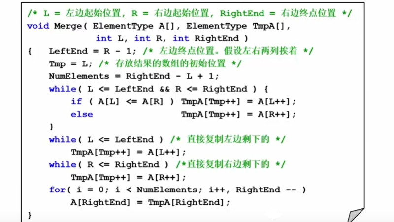
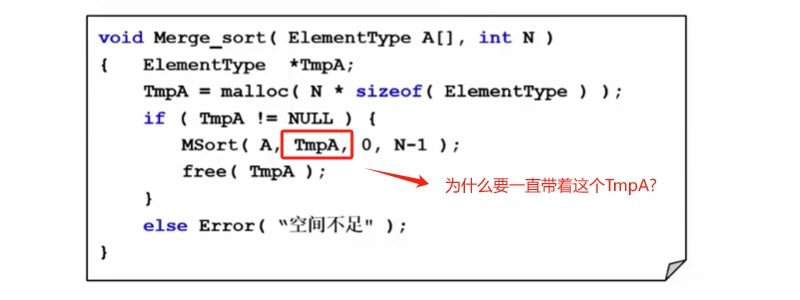
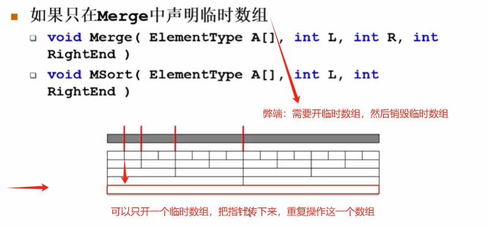
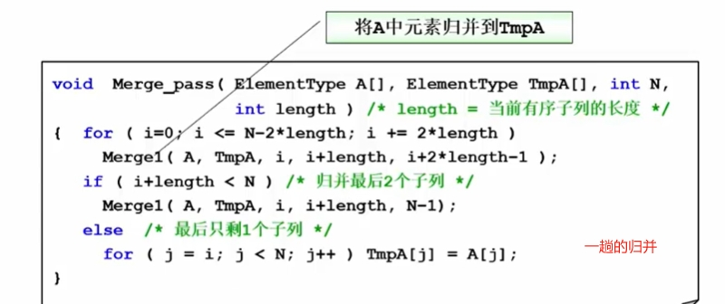

# 归并排序

有序子列的归并问题，与前面的`多选式存放`是一样的。

**有序子列的归并代码实现**

## 分而治之策略

**分而治之-具体实现有两种方式（递归、非递归）**

## 分而治之-递归

这个实现方式非常不友好，我们只需要传入`待排序的数组`，和`数组长度`两个参数。而不是一堆参数，下面是优化后写法。

这个带这着TmpA，只需free一次（释放），如果不这样做，就是这面这种情况，好的做法是只申请一个临时数组。

## 分而治之-非递归
下面是非递归的实现思路和步骤。

一趟的归并的代码实现

完整归并接口实现

## 总结

归并排序虽然很稳定，但是归并排序需要额外的空间（临时数组来回倒数据），在实际排序应用中不被用作`内排序（所有数据在内存中完成）`。归并排序在什么情况特别好呢？就是在`外排序`的时候非常好。