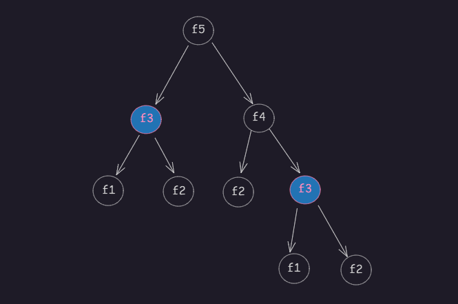

# 递归


## 递归的本质

**递归**在计算机科学中是指一种通过**重复将问题分解为：同类的子类问题**而解决问题的方法。

- 递归简单理解：函数调用函数自身。
- 递归本质原理：将问题拆解为更小的子类问题。
- 递归实现逻辑：确定问题、解决基准问题、拆解问题。


## Fibonacci 

斐波那契：每一项都等于前两项之和

$$
  fib(n) =
  \begin{cases}
  1  & n 	\leq 2 \\\\
  fib(n-1) + fib(n-2) & n > 2
  \end{cases}
$$

### 普通计算-递归 Fibonacci

```javascript
function fib(n){
  if(n <= 1) return n;
  return fib(n-1) + fib(n-2)
}
fibonacci(40) // 40 我的电脑需要2s左右 50 浏览器会卡死
```
上面代码展开就是：

> 呈现为树形结构。

:::info 问题：
斐波那契数列的递归实现通常有性能问题，因为很多**子类问题 被重复计算**。比如，计算fib(5)时fib(3)会被重复计算，当n 很大时，就有更多的**子类问题 被重复计算**，程序执行速度会非常慢。间复杂度是 O(2ⁿ)
:::

:::info 优化：
想要解决这类有重复计算递归性能问题，可通过**记忆化搜索（Memoization）**优化递归。

1. 开一个空数组用于保存第一次的计算结果。下次遇到相同的问题时直接读取。
2. 在计算前，先判断这个问题是否有被计算。如没有就直接计算并且保存。如果有就直接读取数组中的结果。

可以将其时间复杂度由指数级的 O(2ⁿ) 降低到 线性的 O(n)。
:::

## 记忆化搜索-递归
```javascript
const memo = [];
function fibonacci(n) {
  if (n <= 1) return n;
  if (!memo[n]) {
    return memo[n] = fibonacci(n-1) + fibonacci(n-2);
  }else{
    return memo[n]
  }
}
fibonacci(100) // 秒出 因为已经从指数级优化成线性。
```

## 循环计算-Fibonacci
```javascript
function fibonacci(n) {
  let a = 0, b = 1;
  for (let i = 2; i <= n; i++) {
    [a, b] = [b, a + b];
  }
  return n === 0 ? a : b;
}
```

## 递归算法-常规应用
1. 树形结构遍历
> 递归天然适合处理树形数据（如 DOM 树、JSON 嵌套）。
```javascript
// 递归遍历嵌套对象
function deepFind(obj, targetKey) {
  for (const key in obj) {
    if (key === targetKey) return obj[key];
    if (typeof obj[key] === 'object') {
      const res = deepFind(obj[key], targetKey);
      if (res !== undefined) return res;
    }
  }
}
```
2. 分治算法
> 将问题分解为多个子问题（如快速排序）。
```javascript
function quickSort(arr) {
  if (arr.length <= 1) return arr;
  const pivot = arr[0];
  const left = [], right = [];
  for (let i = 1; i < arr.length; i++) {
    arr[i] < pivot ? left.push(arr[i]) : right.push(arr[i]);
  }
  return [...quickSort(left), pivot, ...quickSort(right)];
}
```
3. 回溯算法
> 递归尝试所有可能性（如八皇后问题）。
```javascript
// 生成所有括号组合
function generateParenthesis(n) {
  const res = [];
  function backtrack(str, open, close) {
    if (str.length === 2 * n) {
      res.push(str);
      return;
    }
    if (open < n) backtrack(str + '(', open + 1, close);
    if (close < open) backtrack(str + ')', open, close + 1);
  }
  backtrack('', 0, 0);
  return res;
}
```


## 递归算法-练习

| 题目                                                                            | 难度 | 核心训练点     |
| :------------------------------------------------------------------------------ | :--- | :------------- |
| [反转链表](https://leetcode.com/problems/reverse-linked-list/)                  | ⭐️    | 单链表递归操作 |
| [二叉树的最大深度](https://leetcode.com/problems/maximum-depth-of-binary-tree/) | ⭐️    | 树形递归       |
| [汉诺塔问题](https://leetcode.com/problems/hanota-lcci/)                        | ⭐️⭐️   | 分治思想       |
| [全排列](https://leetcode.com/problems/permutations/)                           | ⭐️⭐️⭐️  | 回溯算法       |


## 递归算法-注意

1. 栈溢出风险：**尾递归**可以适当降低调用栈的栈深，递归深度过大（JavaScript 引擎的调用栈深度有限（约 1e4 层）可能导致调用栈溢出，此时应改用迭代法（循环）。
2. 记忆化存储：缓存会占用内存，对于极大数值（如 n > 1e5 层）需权衡空间复杂度。
