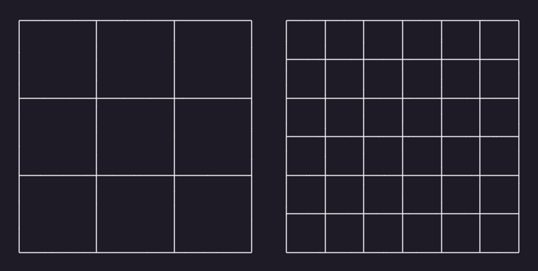

# 像素

## 屏幕尺寸
屏幕尺寸是指屏幕的对角线的长度。它通常用英寸来表示。
> 例如，13 英寸的屏幕对角线长度为 13 英寸。

## 设备像素（物理像素）

设备像素，也称为`物理像素`，是指屏幕上的实际像素。是显示器上最小的物理单位。
> 显示屏幕由许多小方块组成的，每个小方块只能显示一种颜色，而这 1 个小方块就是 单位 1 个像素。

## 逻辑像素

逻辑像素也被称为设备独立像素（Device Independent Pixel，DIP），它是一个在编程和设计领域中使用的抽象概念。与设备屏幕大小无关，是通过程序设置的虚拟像素。
> 我们可以将 `CSS 像素`看做是`逻辑像素`。

## DPR(设备像素比)

DPR 是指设备像素和逻辑像素比值。`DPR = 物理像素/逻辑像素`

> 正常情况下 1 个设备像素（物理像素）代表的其实就是 1 个逻辑像素。随着计算的发展，实现了在有限的屏幕空间内增加更多的像素来实现的的高分辨率屏幕。

> 可以是 1 个设备像素（物理像素）有 n 个逻辑像素。

> 在浏览器中可以使用 `window.devicePixelRatio` 属性查看。

> 通过鼠标缩放页面的时候，其实就是在改变 DPR(设备像素比)；

## 分辨率

像素点总数即为分辨率，像素有逻辑像素、物理像素之分，分辨率也一样，有逻辑分辨率和物理分辨率之分。

## 拓展

### PPI(每英寸像素)
> PPI 是指每英寸上的像素数，它是一个虚拟量，用于衡量屏幕的分辨率。例如，一个 100PPI 的屏幕意味着每英寸上有 100 个像素，值越高意味着画面越细腻

### DPI(每英寸点数)
> DPI 是指每英寸上的点数，它是一个物理量，用于衡量打印机的打印精度。例如，一个 300DPI 的打印机意味着每英寸上可以打印 300 个点。